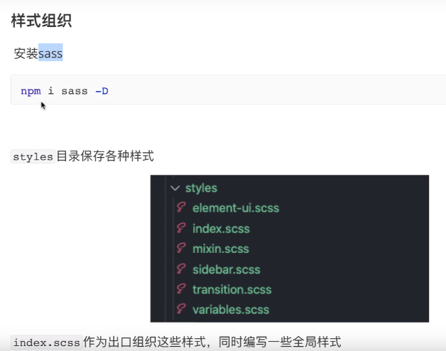

# CSS 部分

## Sass 

<https://sass.bootcss.com/documentation>

是世界上最成熟、稳定、强大的专业级 CSS 扩展语言,2007年。

## Scss

SCSS 和 CSS 写法无差别,不怎么受欢迎，2009年开源。

## Less

<http://lesscss.cn/>

Less 是一门 CSS 预处理语言，它扩展了 CSS
语言，增加了变量、Mixin、函数等特性，使 CSS 更易维护和扩展。

Less 可以运行在 Node 或浏览器端。

## Stylus

<https://stylus.zcopy.site/>

Stylus，2010年产生，来自于Node.js社区，主要用来给Node项目进行CSS预处理支持，在此社区之内有一定支持者，在广泛的意义上人气还完全不如Sass和LESS。

## Tailwind CSS

<https://tailwindcss.com/>

## PostCSS

<https://www.postcss.com.cn/>

是一个用 JavaScript 工具和插件转换 CSS 代码的工具
