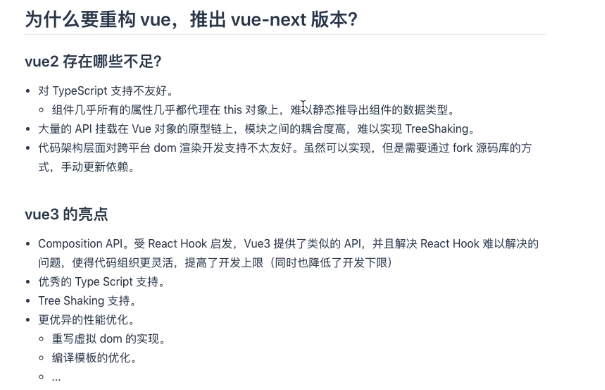
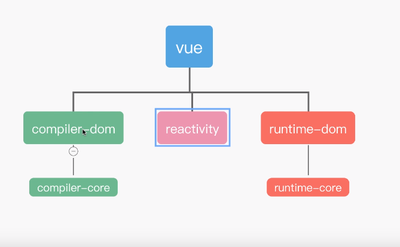
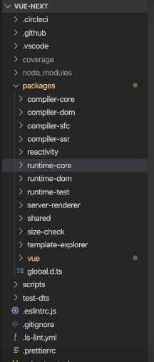
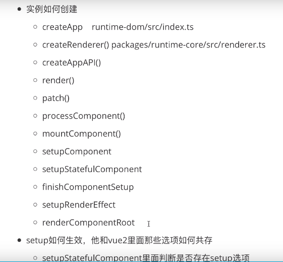
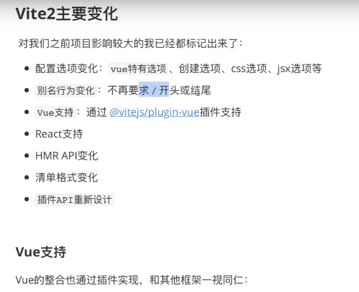

# Vue前端开发规范

## 统一开发环境

### ●开发工具

VSCode

### ●Node

最新稳定版

### ●技术框架选型

前端框架:Vue2.x

PC端Vue项目UI框架:ElementUl/

### ●CSS预编译

SCSS/

### ●脚手架

vue-cli2.0

### ●网络请求

axios

### ●图表

echarts

### ●代码版本控制

git/svn

## 命名规范

应反映该元素的功能或使用通用名称，而不要使用抽象的、晦涩的命名。

###  id和class的命名原则

class:采用"中划线法命名法"，命名规则用""隔开，避免驼峰命名，如-bton
id:采用"小驼峰命名法"。

注意:书写CSS要注意先后顺序和嵌套问题，从性能上考虑尽量减少选择器的层级。

###  文件夹、文件名

(1)文件夹

目录由全小写的名词、动名词或分词命名，由两个以上的词组成，以""进行分隔。
由名词组成(car、order、 cart),尽量是名词(good: car) (bad:greetgood)

以小写开头(good: car)(bad: Car)

(2)资源文件名

资源文件一律以小写字符命名，由两个以上的词组成，以"\_"进行分隔。例如:minc
index.js等。

### Vue文件命名

Vue文件统一以大驼峰命名法命名，仅入口文件index.vue采用小写。

views下面的Vue文件代表着页面的名字，放在模块文件夹之下。只有一个文件的情况下
不会出现文件夹，而是直接放在views目录下面，如Login、Home等。

尽量使用名词，且大写开头，开头的单词就是所属模块名字(CarDetail
CaditCalis)o 常用结尾单词有(Detail、Edit、List、Info、Report)。

以Item结尾的代表着组件(CarListltem、 CarInfoltem)。

components文件夹存放的是可复用公共组件，放在模块文件夹之下，文件夹命名同模块
命名，小写字母开头，如common。大写字母开头，如common/Footer
(文件名采用"大驼峰命名法")。

### Vue路由命名

采用带问号的history路由路径方式命名。路由及参数名称采用首字母小写的驼峰法命
比如:http://www.test.com/test?name=abc&testId=124。

### Vue方法放置顺序

name
components
props
data
created
mounted
filter
computed
watch
activited
update
beforeRouteUpdate
metods

### method自定义方法命名

动宾短语(good:jumpPage.openCarnfoDialog)(bad:go.nextPage. show. open.
login),

Ajax方法以get.post开头，以Data结尾(good:gelListDa, postFormData)(bad:
takeData、 confirmData. getList. postFomm)

事件方法以on开头(onTypeChange. onUsemamlnput)，it refrsh单词除外

尽量使用常用单词开头(set.get.open. close. jump).

驼峰命名(good: getListData) (bad: get_listdata. getlistData).

\(l\) data props方法注意点

使用data里的变量时请先在data里面初始化.

props指定类型，也就是type.

props改变父组件数据基础类型用\$emit，复杂类型直接改。

(2)自定义方法命名注意事项

表单数据请包裹一层form.

不在mounted、created之类的方法写逻辑，取ajax数据。

在created里面监听Bus事件。

### 注意事项

(1)尽量避免直接操作DOM。

(2)尽量使用Vue的语法糖

比如可以用:style代替v-bind:style;用\@click代替voncfick.
(3)将业务型的CSS单独写一个文件，然而功能型的CSS最好和组件一起，不推荐拆
比如一个通用的confirm确认框。

# VUEJS

## VUE2.X

## VUE2.7

## VUE3.X

源代码：<https://github.com/vuejs/vue-next>

git clone <https://github.com/vuejs/vue-next>

{width="6.302083333333333in"
height="4.0625in"}

{width="6.96875in"
height="4.302083333333333in"}

源代码结构

{width="2.25in"
height="5.291666666666667in"}

实例创建及setup

{width="5.84375in" height="5.40625in"}

## VUE CLI

<https://cli.vuejs.org/zh/guide/>

## Vite

<https://vitejs.dev/guide/>

vite源代码
'''js
git clone <https://github.com/vitejs/vite.git>
'''
### vite1

### vite2

## Vue Template Explorer

### Vue3 Template Explorer

<https://vue-next-template-explorer.netlify.app/#%7B%22src%22%3A%22%3Cdiv%3EHello%20World!%5Cr%5Cn%5Cr%5Cn%20%20%3Cdiv%3E%7B%7Bmsg%7D%7D%3C%2Fdiv%3E%5Cr%5Cn%3C%2Fdiv%3E%22%2C%22options%22%3A%7B%22mode%22%3A%22module%22%2C%22prefixIdentifiers%22%3Afalse%2C%22optimizeImports%22%3Afalse%2C%22hoistStatic%22%3Afalse%2C%22cacheHandlers%22%3Afalse%2C%22scopeId%22%3Anull%2C%22inline%22%3Afalse%2C%22ssrCssVars%22%3A%22%7B%20color%20%7D%22%2C%22bindingMetadata%22%3A%7B%22TestComponent%22%3A%22setup-const%22%2C%22setupRef%22%3A%22setup-ref%22%2C%22setupConst%22%3A%22setup-const%22%2C%22setupLet%22%3A%22setup-let%22%2C%22setupMaybeRef%22%3A%22setup-maybe-ref%22%2C%22setupProp%22%3A%22props%22%2C%22vMySetupDir%22%3A%22setup-const%22%7D%7D%7D>

### Vue2 Template Explorer

<https://template-explorer.vuejs.org/#%3Cdiv%20id%3D%22app%22%3E%7B%7B%20msg%20%7D%7D%3C%2Fdiv%3E>
