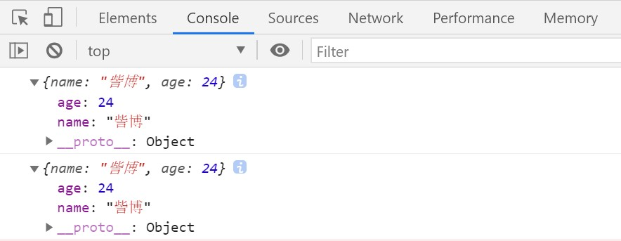
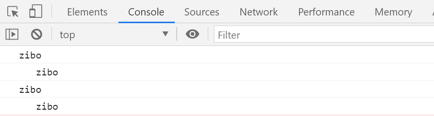
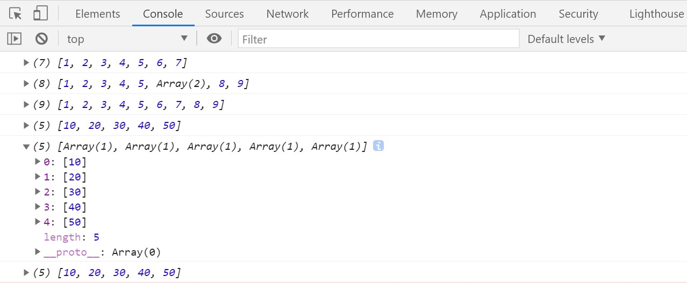
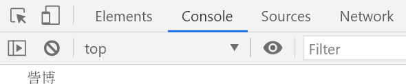

# 七、ES10 新特性

## 0、功能概述

## 1、Object.fromEntries

> 将二维数组或者map转换成对象；

## 2、trimStart 和 trimEnd

> 去除字符串前后的空白字符；

## 3、Array.prototype.flat 与 flatMap

> 将多维数组降维；

## 4、Symbol.prototype.description

> 获取Symbol的字符串描述；

### 1、Object.fromEntries

#### 概述：

> 将二维数组或者map转换成对象；
>
> 之前学的Object.entries是将对象转换成二维数组；

#### 代码实现： 
```html
<!DOCTYPE html>
<html>
  <head>
    <meta charset="utf-8" />
    <title>Object.fromEntries</title>
  </head>
  <body>
    <script>
      // Object.fromEntries：将二维数组或者map转换成对象
      // 之前学的Object.entries是将对象转换成二维数组
      // 此方法接收的是一个二维数组，或者是一个map集合
      // 二维数组
      const result = Object.fromEntries([
        ["name", "訾博"],
        ["age", 24],
      ]);

      console.log(result);
      const m = new Map();
      m.set("name", "訾博");
      m.set("age", 24);
      const result1 = Object.fromEntries(m);
      console.log(result1);
    </script>
  </body>

</html>
```

#### 运行结果：



### 2、trimStart 和 trimEnd

#### 概述：

> 去掉字符串前后的空白字符；

#### 代码实现： 
```html
<!DOCTYPE html>
<html>
  <head>
    <meta charset="utf-8" />
    <title>trimStart 和 trimEnd</title>
  </head>
  <body>

    <script>
      // trimStart 和 trimEnd let str = "    zibo    ";
      console.log(str.trimLeft());
      console.log(str.trimRight());
      console.log(str.trimStart());
      console.log(str.trimEnd());
    </script>

  </body>

</html>
```
#### 运行结果：



### 3、Array.prototype.flat 与 flatMap

#### 概述：

> 将多维数组转换成低维数组；

#### 代码实现：
```html
<!DOCTYPE html>
<html>
  <head>
    <meta charset="utf-8" />
    <title>Array.prototype.flat 与 flatMap</title>
  </head>
  <body>

    <script>
      // Array.prototype.flat 与 flatMap
      // flat
      // 将多维数组转换成低维数组
      // 将二维数组转换成一维数组
      const arr = [1, 2, 3, [4, 5], 6, 7];
      console.log(arr.flat());

      // 将三维数组转换成二维数组
      const arr2 = [1, 2, 3, [4, 5, [6, 7]], 8, 9];
      console.log(arr2.flat());
      // 将三维数组转换成一维数组
      console.log(arr2.flat(2));

      // flatMap
      const arr3 = [1, 2, 3, 4, 5];
      const result0 = arr3.map((item) => item * 10);
      console.log(result0);
      const result = arr3.map((item) => [item * 10]);
      console.log(result);
      const result1 = arr3.flatMap((item) => [item * 10]);
      console.log(result1);

    </script>

  </body>

</html>
```
#### 运行结果：



### 4、Symbol.prototype.description

#### 概述：

> 获取Symbol的描述字符串；

#### 代码实现： 
```html
<!DOCTYPE html>

<html>
  <head>
    <meta charset="utf-8" />
    <title>Symbol.prototype.description</title>
  </head>
  <body>
    <script>
      // Symbol.prototype.description
      // 获取Symbol的描述字符串
      // 创建Symbol
      let s = Symbol(" 訾 博 ");
      console.log(s.description);
    </script>

  </body>

</html>
```
#### 运行结果：


