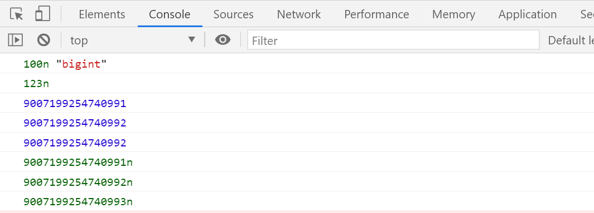

# 八、ES11 新特性

## 0、功能概述

## 1、String.prototype.matchAll

> 用来得到正则批量匹配的结果；

## 2、类的私有属性

> 私有属性外部不可访问直接；

## 3、Promise.allSettled

> 获取多个promise执行的结果集；

## 4、可选链操作符

> 简化对象存在的判断逻辑；

## 5、动态 import 导入

> 动态导入模块，什么时候使用什么时候导入；
>

## 6、BigInt

> 大整型；

## 7、globalThis 对象

> 始终指向全局对象window；

## 8、示例

### 1、String.prototype.matchAll

#### 概述：

> 用来得到正则批量匹配的结果；

#### 代码实现：
```html
<!DOCTYPE html>

<html>
<head>
    <meta charset="utf-8" />
    <title>String.prototype.matchAll</title>
</head>
<body>
    <script>
        // String.prototype.matchAll
        // 用来得到正则批量匹配的结果
        let str = `
                <ul>
                <li>
                <a>肖生克的救赎</a>
                <p>上映日期: 1994-09-10</p>
                </li>
                <li>
                <a>阿甘正传</a>
                <p>上映日期: 1994-07-06</p>
                </li>
                </ul>
                `;
        // 正则
        const reg = /<li>.*?<a>(.*?)</a >.*? <p>(.*?)</p> / gs;
        const result = str.matchAll(reg);
        // 返回的是可迭代对象，可用扩展运算符展开
        // console.log(...result);
        // 使用for...of...遍历
        for (let v of result) {
            console.log(v);
        }
    </script>
</body>
</html>
```
#### 运行结果：


### 2、类的私有属性

#### 概述：

> 私有属性外部不可访问直接；

#### 代码实现： 
```html
<!DOCTYPE html>
<html>
<head>
    <meta charset="utf-8" />
    <title>类的私有属性</title>
</head>
<body>
    <script>
        // 类的私有属性
        class Person {
            // 公有属性
            name; // 私有属性#age; #weight; // 构造方法
            constructor(name, age, weight) {
                this.name = name;
                this.#age = age;
                this.#weight = weight;
            }

            intro() {
                console.log(this.name);
                console.log(this.#age);
                console.log(this.#weight);
            }
        } // 实例化
        const girl = new Person("小兰", 18, "90kg");
        console.log(girl); // 公有属性的访问
        console.log(girl.name); // 私有属性的访问
        console.log(girl.age); // undefined // 报错Private field '#age' must be declared in an enclosing class // console.log(girl.#age); girl.intro();
    </script>
</body>

</html>
```
#### 运行结果：


### 3、Promise.allSettled

#### 概述：

> 获取多个promise执行的结果集；

#### 代码实现： 
```html
<html>
  <head>
    <meta charset="utf-8" />
    <title>Promise.allSettled</title>
  </head>
  <body>
    <script>
      // Promise.allSettled
      // 获取多个promise执行的结果集
      // 声明两个promise对象

      const p1 = new Promise((resolve,reject)=>{ setTimeout(()=>{
            resolve("商品数据------1");
      },1000);
      });

      const p2 = new Promise((resolve,reject)=>{ setTimeout(()=>{
      reject(
      },1000);

      });

      // 调用Promise.allSettled方法
      const result = Promise.allSettled([p1,p2]); console.log(result);
      const result1 = Promise.all([p1,p2]); // 注意区别
      console.log(result1);
    </script>
  </body>
</html>

```

#### 运行结果：


### 4、可选链操作符

#### 概述：

> 如果存在则往下走，省略对对象是否传入的层层判断；

#### 代码实现： 
```html
<!DOCTYPE html>

<html>
  <head>
    <meta charset="utf-8" />

    <title>可选链操作符</title>
  </head>

  <body>
    <script>
      // 可选链操作符
      // ?.
      function main(config) {
        // 传统写法
        // const dbHost = config && config.db && config.db.host;
        // 可选链操作符写法
        const dbHost = config?.db?.host;
        console.log(dbHost);
      }

      main({
        db: {
          host: "192.168.1.100",
          username: "root"
        },

        cache: {
          host: "192.168.1.200",
          username: "admin"
        }
      });
    </script>
  </body>
</html>
```

#### 运行结果：


### 5、动态 import 导入

#### 概述：

> 动态导入模块，什么时候使用时候导入；

#### 代码实现：

> **hello.js：**
```js
export function hello(){ alert('Hello');
}
```

> **app.js：**
```js
// import * as m1 from "./hello.js"; // 传统静态导入

//获取元素
const btn = document.getElementById('btn');
btn.onclick = function () {
    import('./hello.js').then(module => {
        module.hello();
    });
}
```
#### 动态import加载.html： 
```html
<!DOCTYPE html>
<html lang="en">
  <head>
    <meta charset="UTF-8" />
    <meta name="viewport" content="width=device-width, initial-scale=1.0" />
    <title>动态 import</title>
  </head>

  <body>
    <button id="btn">点击</button>
    <script src="app.js" type="module"></script>
  </body>
</html>

```
#### 运行结果：

### 6、BigInt

#### 概述：

> 更大的整数；

#### 代码实现： 
```html
<!DOCTYPE html>
<html>
  <head>
    <meta charset="utf-8" />
    <title>BigInt</title>
  </head>

  <body>
    <script>
      // BigInt
      // 大整型
      let n = 100n;
      console.log(n, typeof n); // 函数：普通整型转大整型let m = 123; console.log(BigInt(m)); // 用于更大数值的运算
      let max = Number.MAX_SAFE_INTEGER;
      console.log(max);
      console.log(max + 1);
      console.log(max + 2); // 出错了
      console.log(BigInt(max));
      console.log(BigInt(max) + BigInt(1));
      console.log(BigInt(max) + BigInt(2));
    </script>
  </body>
</html>
```
#### 运行结果：



### 7、globalThis 对象

#### 概述：

> 始终指向全局对象window；

#### 代码实现：
```html
<!DOCTYPE html>
<html>
  <head>
    <meta charset="utf-8" />
    <title>globalThis 对象</title>
  </head>

  <body>
    <script>
      // globalThis 对象 : 始终指向全局对象window console.log(globalThis);
    </script>
  </body>
</html>
```
#### 运行结果：


