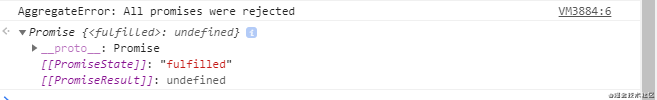
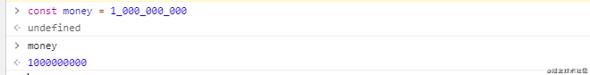

# 九、ES12(2021)
<!-- Markdown 目录语法 -->
[[toc]]
## **1. replaceAll**

返回一个全新的字符串，所有符合匹配规则的字符都将被替换掉
```js
const str = 'hello world';

str.replaceAll('l', ''); // "heo word"
```

## **2. Promise.any**

Promise.any() 接收一个Promise可迭代对象，只要其中的一个 promise
成功，就返回那个已经成功的 promise 。如果可迭代对象中没有一个 promise
成功（即所有的 promises 都失败/拒绝），就返回一个失败的 promise
```js
const promise1 = new Promise((resolve, reject) => reject('我是失败的Promise_1'));
const promise2 = new Promise((resolve, reject) => reject('我是失败的Promise_2'));
const promiseList = [promise1, promise2];
Promise.any(promiseList)
    .then(values => {
        console.log(values);
    })
    .catch(e => {
        console.log(e);
    });
```


## **3. WeakRefs**

使用WeakRefs的Class类创建对对象的弱引用(对对象的弱引用是指当该对象应该被GC回收时不会阻止GC的回收行为)

## **4. 逻辑运算符和赋值表达式**

逻辑运算符和赋值表达式，新特性结合了逻辑运算符（&&，||，??）和赋值表达式而JavaScript已存在的
复合赋值运算符有：
```js
a ||= b
//等价于
a = a || (a = b)
a &&= b
//等价于

a = a && (a = b)
a ??= b
//等价于
a = a ?? (a = b)
```

## **5. 数字分隔符**

数字分隔符，可以在数字之间创建可视化分隔符，通过_下划线来分割数字，使数字更具可读性
```js
const money = 1_000_000_000;
//等价于
const money = 1000000000;
1_000_000_000 === 1000000000; // true
```

