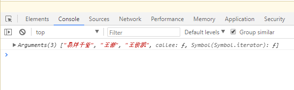
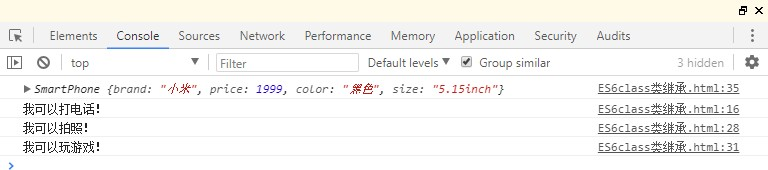

# 二、ES6 新特性
<!-- Markdown 目录语法 -->
[[toc]]
## 0、功能概述
## 1、let 关键字
> 声明局部变量
## 2、const 关键字
> 声明常量；
## 3、变量和对象的解构赋值
> 简化变量声明：从；

## 4、模板字符串

> 声明自带格式的字符串；

## 5、简化对象和函数写法

> 简化对象和函数写法；

## 6、箭头函数

> 简化函数写法；

## 7、ES6中函数参数的默认值

> 给函数的参数设置默认值；

## 8、rest参数

> 拿到实参；

## 9、扩展运算符

> 将一个数组转为用逗号分隔的参数序列；

## 10、Symbol

> 表示独一无二的值；

## 11、迭代器

> 用来遍历集合、数组等；

## 12、生成器

> 是一种异步编程解决方案；

## 13、Promise

> 非常强大的异步编程的新解决方案；

## 14、Set集合

> 类似数组，但元素不重复的集合；

## 15、Map集合

> 键值对集合；

## 16、class类

> 像java实体类一样声明js类；

## 17、数值扩展

> 增加一些数值相关的方法等；

## 18、对象扩展

> 增加一些对象相关的方法等；

## 19、模块化

> 模块化、组件化；

## 20、Babel对ES6模块化代码转换

> 为了适配浏览器，将更新的ES规范转换成ES5规范；

## 21、ES6模块化引入NPM包

> 像导入模块一样导入npm包；

# 三、ES6 实例

## 1、let 关键字

### 特性：

> let 关键字用来声明变量，使用 let 声明的变量有几个特点：

1.  不允许重复声明；
2.  块儿级作用域（局部变量）；
3.  不存在变量提升；
4.  不影响作用域链；

### let创建变量代码示例：
```js
    // let关键字使用示例： let a; // 单个声明
    let b, c, d; // 批量声明
    let e = 100; // 单个声明并赋值
    let f = 521,
      g = "iloveyou",
      h = []; // 批量声明并赋值
```
### 不允许重复声明：

#### 代码实现： 
```js
    // 1. 不允许重复声明；
    let dog = "狗";
    let dog = "狗";
    // 报错Uncaught SyntaxError: Identifier 'dog' has already been declared;
```
#### 运行结果：


### 块儿级作用域（局部变量）：
#### 代码实现：
```js
    // 2. 块儿级作用域（局部变量）；
    {
      let cat = " 猫 ";
      console.log(cat);
    }
    console.log(cat);
    // 报错：Uncaught ReferenceError: cat is not defined
```
#### 运行结果：


### 不存在变量提升：

#### 什么是变量提升：

> 就是在变量创建之前使用（比如输出：输出的是默认值），let不存在，var存在；

#### 代码实现：
```js
    // 3. 不存在变量提升；
    // 什么是变量提升：就是在变量创建之前使用（比如输出：输出的是默认值），let不存在，var存在；
    console.log(people1); // 可输出默认值
    console.log(people2); // 报错：Uncaught ReferenceError: people2 is not
    defined;
    var people1 = "大哥"; // 存在变量提升
    let people2 = "二哥"; // 不存在变量提升
```
#### 运行结果：


### 不影响作用域链：

#### 代码实现：
```js
    // 4. 不影响作用域链；
    // 什么是作用域链：很简单，就是代码块内有代码块，跟常规编程语言一样，上级代码块中的局部变量下级可用
    {
      let p = "大哥";
      function fn() {
        console.log(p); // 这里是可以使用的
      }
      fn();
    }
```
#### 运行结果：


### 全部演示代码：

```html
<!DOCTYPE html>
<html lang="en">
  <head>
    <meta charset="UTF-8" />
    <meta http-equiv="X-UA-Compatible" content="IE=edge" />
    <meta name="viewport" content="width=device-width, initial-scale=1.0" />
    <title>let 关键字</title>
  </head>
  <body></body>
  <script>
    // 0.let关键字使用示例： let a; // 单个声明

    /*  let b, c, d; // 批量声明
        let e = 100; // 单个声明并赋值
        let f = 521,
          g = "iloveyou",
          h = []; // 批量声明并赋值 */
    // 1. 不允许重复声明；
    /*  let dog = "狗";
            let dog = "狗";
            // 报错：Uncaught SyntaxError: Identifier 'dog' has already been
            declared;
        */
    // 2. 块儿级作用域（局部变量）；

    /* {
          let cat = " 猫 ";
          console.log(cat);
        }
        console.log(cat); */

    // 报错：Uncaught ReferenceError: cat is not defined
    // 3. 不存在变量提升；
    // 什么是变量提升：就是在变量创建之前使用（比如输出：输出的是默认值），let不存在，var存在；

    console.log(people1); // 可输出默认值
    console.log(people2); // 报错：Uncaught ReferenceError: people2 is not defined;
    var people1 = "大哥"; // 存在变量提升
    let people2 ="二哥"; 
    /* {
          let p = "大哥";
          function fn() {
            console.log(p); // 这里是可以使用的
          }
          fn();

        } */ // 不存在变量提升 // 4. 不影响作用域链； // 什么是作用域链：很简单，就是代码块内有代码块，跟常规编程语言一样，上级代码块中的局部变量下级可用
  </script>
</html>
```

### 应用场景：

> 以后声明变量使用 let 就对了；

### let案例：点击div更改颜色

#### 代码实现：
```html
<!DOCTYPE html>
<html lang="en">
  <head>
    <meta charset="UTF-8" />
    <meta name="viewport" content="width=device-width, initial-scale=1.0" />
    <title>let案例：点击div更改颜色</title>
    <link crossorigin="anonymous" href="https://cdn.bootcss.com/twitter- bootstrap/3.3.7/css/bootstrap.min.css" rel="stylesheet"/>
    <style>
      .item {
        width: 100px;
        height: 50px;
        border: solid 1px rgb(42, 156, 156);
        float: left;
        margin-right: 10px;
      }
    </style>
  </head>
  <body>
    <div class="container">
      <h2 class="page-header">let案例：点击div更改颜色</h2>
      <div class="item"></div>
      <div class="item"></div>
      <div class="item"></div>
    </div>
    <script>
      // 获取div元素对象
      let items = document.getElementsByClassName("item"); // 遍历并绑定事件
      for (let i = 0; i < items.length; i++) {
        items[i].onclick = function() {
          // 修改当前元素的背景颜色
          // this.style.background = 'pink'; // 写法一：常规写法一般无异常

          items[i].style.background = "pink"; // 写法二 // 写法二：需要注意的是for循环内的i必须使用let声明 // 如果使用var就会报错，因为var是全局变量， // 经过循环之后i的值会变成3，items[i]就会下标越界 // let是局部变量 // 我们要明白的是当我们点击的时候，这个i是哪个值 // 使用var相当于是： // { var i = 0; } // { var i = 1; } // { var i = 2; } // { var i = 3; } // 下面的声明会将上面的覆盖掉，所以点击事件每次找到的都是3 // 而使用let相当于是： // { let i = 0; } // { let i = 1; } // { let i = 2; } // { let i = 3; } // 由于let声明的是局部变量，每一个保持着原来的值 // 点击事件调用的时候拿到的是对应的i
        };
      }
    </script>
  </body>
</html>
```

#### 运行结果：


## 2、const 关键字

### 特性：

> const 关键字用来声明**常量**，const 声明有以下特点：
1.  声明必须赋初始值；
2.  标识符一般为大写（习惯）；
3.  不允许重复声明；
4.  值不允许修改；
5.  块儿级作用域（局部变量）；

### const创建变量代码示例：

### 声明必须赋初始值：

#### 代码实现：

#### 运行结果：


### 不允许重复声明：

#### 代码实现： 
```js
    // 3. 不允许重复声明；
    //const CAT = "喵喵";
    //const CAT = "喵喵";
```
#### 运行结果：


### 值不允许修改：

#### 注意：

> 对数组元素的修改和对对象内部的修改是可以的（数组和对象存的是引用地址）；

#### 代码实现：
```js
    // 4. 值不允许修改；
    //const CAT = "喵喵";
    //CAT = "咪咪";
```
#### 运行结果：


### 块儿级作用域（局部变量）：

#### 代码实现：

```js
    // 5. 块儿级作用域（局部变量）；
   {
      const CAT = "喵喵";
      console.log(CAT);
    }
    console.log(CAT); 
```

#### 运行结果：


### 全部演示代码：
```html
<!DOCTYPE html>
<html lang="en">
  <head>
    <meta charset="UTF-8" />
    <meta http-equiv="X-UA-Compatible" content="IE=edge" />
    <meta name="viewport" content="width=device-width, initial-scale=1.0" />
    <title>Document</title>
  </head>
  <body></body>
  <script>
    // 1. 声明必须赋初始值；
    //const CAT;
    // 2. 标识符一般为大写（习惯）；
    // const dog = "旺财"; // 小写也不错
    // 3. 不允许重复声明；
    //const CAT = "喵喵";
    //const CAT = "喵喵";
    // 4. 值不允许修改；
    //const CAT = "喵喵";
    //CAT = "咪咪";
    // 5. 块儿级作用域（局部变量）；
    /*  {
      const CAT = "喵喵";
      console.log(CAT);
    }
    console.log(CAT); */
  </script>
</html>
```


### 应用场景：

> 声明对象类型使用 const，非对象类型声明选择 let；
> 
## 3、变量和对象的解构赋值

### 什么是解构赋值：

> ES6
> 允许按照一定模式，从数组和对象中提取值，对变量进行赋值，这被称为**解构赋值**；

### 代码演示及相关说明：
```html
<!DOCTYPE html>
<html>
  <head>
    <meta charset="utf-8" />
    <title>解构赋值</title>
  </head>
  <body></body>
  <script>
    // ES6 允许按照一定模式，从数组和对象中提取值，对变量进行赋值，这被称为解构赋值；
    // 1、数组的解构赋值
    const F4 = ["大哥", "二哥", "三哥", "四哥"];
    let [a, b, c, d] = F4; // 这就相当于我们声明4个变量a,b,c,d，其值分别对应"大哥","二哥","三哥","四哥" console.log(a + b + c + d); // 大哥二哥三哥四哥 // 2、对象的解构赋值
    const F3 = {
      name: "大哥",
      age: 22,
      sex: "男",
      xiaopin: function() {
        // 常用
        console.log("我会演小品！");
      }
    }; // 注意解构对象这里用的是{} console.log(name + age + sex + xiaopin); // 大哥22男xiaopin(); // 此方法可以正常调用

    let { name, age, sex, xiaopin } = F3;
  </script>
</html>
```
### 应用场景：

> 频繁使用对象方法、数组元素，就可以使用解构赋值形式；

## 4、模板字符串

### 概述：

> 模板字符串（template
> string）是增强版的字符串，用反引号（`）标识，特点：
> 字符串中可以出现换行符；
> 可以使用 ${xxx} 形式引用变量；

### 代码演示及相关说明：
```html
<!DOCTYPE html>
<html>
  <head>
    <meta charset="utf-8" />
    <title></title>
  </head>
  <body></body>
  <script>
    // 声明字符串的方法：单引号（''）、双引号（""）、反引号（``）
    // 声明
    let string = `我也一个字符串哦！`;
    console.log(string); // 特性 // 1、字符串中可以出现换行符
    let str = `<ul>
      <li>大哥</li>
      <li>二哥</li>
      <li>三哥</li>
      <li>四哥</li>
      </ul>`;
    console.log(str); // 2、可以使用 ${xxx} 形式引用变量
    let s = "大哥";
    let out = `${s}是我最大的榜样！`;
    console.log(out);
  </script>
</html>
```

### 应用场景：

> 当遇到字符串与变量拼接的情况使用模板字符串；

## 5、简化对象和函数写法

### 概述：

> ES6
> 允许在大括号里面，直接写入变量和函数，作为对象的属性和方法。这样的书写更加简洁；

### 代码示例及相关说明：
```html
<!DOCTYPE html>
<html lang="en">
  <head>
    <meta charset="UTF-8" />
    <meta http-equiv="X-UA-Compatible" content="IE=edge" />
    <meta name="viewport" content="width=device-width, initial-scale=1.0" />
    <title>简化对象写法</title>
  </head>
  <body></body>
  <script>
    // ES6允许在对象的大括号内直接写入变量和函数作为对象的属性和方法

    // 变量和函数
    let name = "訾博";
    let change = function() {
      console.log("活着就是为了改变世界！");
    }; //创建对象

    const school = {
      // 完整写法
      // name:name,
      // change:change
      // 简化写法
      name,
      change, // 声明方法的简化
      say() {
        console.log("言行一致！");
      }
    };
    school.change();
    school.say();
  </script>
</html>
```
## 6、箭头函数

### 概述：

> ES6允许使用箭头（=>）定义函数，箭头函数提供了一种更加简洁的函数书写方式，箭头函数多用于匿名函数的定义；

### 注意点：

1.  如果形参只有一个，则小括号可以省略；
2.  函数体如果只有一条语句，则花括号可以省略，函数的返回值为该条语句的执行结果；
3.  箭头函数 this 指向声明时所在作用域下 this 的值；
4.  箭头函数不能作为构造函数实例化；
5.  不能使用 arguments；

### 特性：

1.  箭头函数的this是静态的，始终指向函数声明时所在作用域下的this的值；
2.  不能作为构造实例化对象；
3.  不能使用 arguments 变量；

### 代码演示及相关说明：

> 注意：箭头函数不会更改 this 指向，用来指定回调函数会非常合适；
```html
<!DOCTYPE html>

<html lang="en">
  <head>
    <meta charset="UTF-8" />
    <meta http-equiv="X-UA-Compatible" content="IE=edge" />
    <meta name="viewport" content="width=device-width, initial-scale=1.0" />
    <title>箭头函数</title>
  </head>
  <body>
  </body>
  <script>
    // ES6允许使用箭头（=>）定义函数
    // 传统写法：无参数
    var say = function () {
      console.log("hello！");
    };
    say();
    // ES写法2：无参数
    let speak = () => console.log("hello 哈哈！");
    speak();
    // 传统写法：一个参数
    var hello = function (name) {
      return "hello " + name;
    };
    console.log(hello("訾博"));
    // ES6箭头函数：一个参数
    let hi = (name) => "hi " + name;
    console.log(hi("訾博"));
    // 传统写法：多个参数
    var sum = function (a, b, c) {
      return a + b + c;
    };
    console.log(sum(1, 2, 3));
    // ES6箭头函数：多个参数
    let he = (a, b, c) => a + b + c;
    console.log(he(1, 2, 3));
    // 特性
    // 1、箭头函数的this是静态的，始终指向函数声明时所在作用域下的this的值
    const school = {
      name: "大哥",
    };

    // 传统函数
    function getName() {
      console.log("getName：" + this.name);
    }

    // 箭头函数
    getName1 = () => console.log("getName1：" + this.name);
    window.name = "訾博";
    // 直接调用getName(); getName1();
    // 使用call调用
    getName.call(school);
    getName1.call(school);

    // 结论：箭头函数的this是静态的，始终指向函数声明时所在作用域下的this的值
    // 2、不能作为构造实例化对象
    // let Persion = (name,age) => {
    //  this.name = name;
    //  this.age = age;
    // }
    // let me = new Persion("訾博",24);
    // console.log(me);
    // 报错：Uncaught TypeError: Persion is not a constructor
    // 3、不能使用 arguments 变量
    // let fn = () => console.log(arguments);
    // fn(1,2,3);
    // 报错：Uncaught ReferenceError: arguments is not defined

  </script>
</html>
```

### 运行结果：
> 

### 需求-1：点击 div 2s 后颜色变成『粉色』：

#### 传统写法存在问题：

代码：
```html
<!DOCTYPE html>
<html>
  <head>
    <meta charset="utf-8" />
    <title>箭头函数的实践和应用场景</title>
    <style>
      div {
          width: 200px;
          height: 200px;
          background: #58a;
      }
    </style>
  </head>

  <body>
    <div id="ad"></div>

    <script>
      // 需求-1   点击 div 2s 后颜色变成『粉色』
      // 获取元素
      let ad = document.getElementById("ad"); // 绑定事件
      ad.addEventListener("click", function() {
        // 传统写法
        // 定时器：参数1：回调函数；参数2：时间；
        setTimeout(function() {
          console.log(this);
          this.style.background = "pink";
        }, 2000); // 报错Cannot set property 'background' of undefined
      });
    </script>
  </body>
</html>
```

> **报错：**


#### 传统写法问题解决：
```html
<!DOCTYPE html>
<html lang="en">
  <head>
    <meta charset="UTF-8" />
    <meta http-equiv="X-UA-Compatible" content="IE=edge" />
    <meta name="viewport" content="width=device-width, initial-scale=1.0" />
    <title>点击 div 2s 后颜色变成『粉色』</title>
    <style>
      div {
        width: 200px;
        height: 200px;
        background: #58a;
      }
    </style>
  </head>
  <body>
    <div id="ad">请点我</div>
  </body>

  <script>
    // 需求-1 点击 div 2s 后颜色变成『粉色』
    // 一.传统写法
    // 获取元素
    /* let ad = document.getElementById("ad");
    // 绑定事件
    ad.addEventListener("click", function () {
    // 定时器：参数1：回调函数；参数2：时间；
      setTimeout(function () {
        console.log(this);
        this.style.background = "pink";
      }, 2000);
      // 报错Cannot set property 'background' of undefined
    }); */

    // 二. 传统写法解决方式
    // 获取元素
    let ad = document.getElementById("ad"); // 绑定事件
    ad.addEventListener("click", function() {
      // 传统写法
      // 保存 this 的值
      let _this = this; // 定时器：参数1：回调函数；参数2：时间；
      setTimeout(function() {
        console.log(this);
        _this.style.background = "pink";
      }, 2000); // 报错Cannot set property 'background' of undefined
    });
  </script>
</html>
```

#### ES6写法：

> （从这个案例中就能理解ES6箭头函数的特性了）
```html
<!DOCTYPE html>

<html lang="en">
  <head>
    <meta charset="UTF-8" />
    <meta http-equiv="X-UA-Compatible" content="IE=edge" />
    <meta name="viewport" content="width=device-width, initial-scale=1.0" />
    <title>点击 div 2s 后颜色变成『粉色』</title>
    <style>
      div {
        width: 200px;
        height: 200px;
        background: #58a;
      }
   </style>
  </head>
  <body>
    <div id="ad">请点我</div>
  </body>
  <script>
    // 需求-1 点击 div 2s 后颜色变成『粉色』

    //三.ES6
    // 获取元素
    let ad = document.getElementById("ad");
    // 绑定事件：这也是错误写法，这里的this还是window
    // ad.addEventListener("click", () => {
    //  // ES6写法
    //  // 定时器：参数1：回调函数；参数2：时间；
    //  setTimeout(() => this.style.background = 'pink',2000);
    //  }
    // )
    // 绑定事件
    ad.addEventListener("click", function () {
      // ES6写法
      // 定时器：参数1：回调函数；参数2：时间；
      // 这个this才是ad
      setTimeout(() => (this.style.background = "pink"), 2000);
    });
  </script>
</html>
```

### 需求-2 从数组中返回偶数的元素： 
```html
<!DOCTYPE html>
<html lang="en">
  <head>
    <meta charset="UTF-8" />
    <meta http-equiv="X-UA-Compatible" content="IE=edge" />
    <meta name="viewport" content="width=device-width, initial-scale=1.0" />
    <title>从数组中返回偶数的元素</title>
    <style></style>
  </head>
  <body>
  </body>
  <script>

    //需求-2  从数组中返回偶数的元素
    const arr = [1, 6, 9, 10, 100, 25];
    //一.以前的方式
    // const result = arr.filter(function(item){
    //  if(item % 2 === 0){
    //  return true;
    //  }else{
    //  return false;
    //  }
    // });
    const result = arr.filter((item) => item % 2 === 0);
    console.log(result);
    // 箭头函数适合与 this 无关的回调. 定时器, 数组的方法回调
    // 箭头函数不适合与 this 有关的回调. 事件回调, 对象的方法
  </script>
</html>
```

## 7、ES6中函数参数的默认值

### 概述：

> ES允许给函数的参数赋初始值；

### 代码示例及相关说明：
```html
<!DOCTYPE html>
<html lang="en">
  <head>
    <meta charset="UTF-8" />
    <meta http-equiv="X-UA-Compatible" content="IE=edge" />
    <meta name="viewport" content="width=device-width, initial-scale=1.0" />
    <title>函数参数默认值</title>
  </head>
  <body>
  </body>
  <script>
    //ES6 允许给函数参数赋值初始值
    //1. 形参初始值 具有默认值的参数, 一般位置要靠后(潜规则)
    function add(a, b, c = 10) {
      return a + b + c;
    }
    let result = add(1, 2);
    console.log(result); // 13
    //2. 与解构赋值结合
    // 注意这里参数是一个对象
    function connect({ host = "127.0.0.1", username, password, port }) {
      console.log(host);
      console.log(username);
      console.log(password);
      console.log(port);
    }

    connect({
      host: "atguigu.com",
      username: "root",
      password: "root",
      port: 3306,
    });
  </script>
</html>
```

## 8、rest参数
### 概述：

> ES6 引入 rest 参数，用于获取函数的实参，用来代替 arguments；
> 参考文章：<https://www.jianshu.com/p/50bcb376a419>

### 代码示例及相关说明：
```html
<!DOCTYPE html>
<html lang="en">
  <head>
    <meta charset="UTF-8" />
    <meta http-equiv="X-UA-Compatible" content="IE=edge" />
    <meta name="viewport" content="width=device-width, initial-scale=1.0" />
    <title>rest参数</title>
  </head>
  <body>
  </body>
  <script>
    // ES5获取实参的方式
    function data() {
      console.log(arguments);
    }
    data("大哥", "二哥", "三哥", "四哥");
    // ES6的rest参数...args，rest参数必须放在最后面
    function data(...args) {
      console.log(args); // fliter some every map
    }
    data("大哥", "二哥", "三哥", "四哥");
  </script>
</html>
```

### 运行结果：


## 9、扩展运算符

### 介绍：

> ... 扩展运算符能将数组转换为逗号分隔的参数序列；
> 扩展运算符（spread）也是三个点（...）。它好比 rest
> 参数的逆运算，将一个数组转为用逗号分隔的参数序列，对数组进行解包；

### 基本使用：
```html
<!DOCTYPE html>
<html lang="en">
  <head>
    <meta charset="UTF-8" />
    <meta http-equiv="X-UA-Compatible" content="IE=edge" />
    <meta name="viewport" content="width=device-width, initial-scale=1.0" />
    <title>扩展运算符</title>
  </head>
  <body>
  </body>
  <script>

    // ... 扩展运算符能将数组转换为逗号分隔的参数序列
    //声明一个数组 ...
    const tfboys = ["易烊千玺", "王源", "王俊凯"];
    // => '易烊千玺','王源','王俊凯'
    // 声明一个函数
    function chunwan() {
      console.log(arguments);
    }
    chunwan(...tfboys); // chunwan('易烊千玺','王源','王俊凯')
  </script>
</html>
```

### 运行结果：



#### 应用：
```html
<!DOCTYPE html>

<html lang="en">
  <head>
    <meta charset="UTF-8" />
    <meta http-equiv="X-UA-Compatible" content="IE=edge" />
    <meta name="viewport" content="width=device-width, initial-scale=1.0" />
    <title>扩展运算符应用</title>
  </head>
  <body>
  </body>
  <script>
    //1. 数组的合并 情圣 误杀  唐探
    const kuaizi = ["王太利", "肖央"];
    const fenghuang = ["曾毅", "玲花"];
    // 传统的合并方式
    //const zuixuanxiaopingguo = kuaizi.concat(fenghuang);
    const zuixuanxiaopingguo = [...kuaizi, ...fenghuang];
    console.log(zuixuanxiaopingguo);

    //2. 数组的克隆
    const sanzhihua = ["E", "G", "M"];
    const sanyecao = [...sanzhihua]; // ['E','G','M']
    console.log(sanyecao);

    //3. 将伪数组转为真正的数组
    const divs = document.querySelectorAll("div");
    const divArr = [...divs];
    console.log(divArr); // arguments

  </script>

</html>
```

#### 运行结果：


## 10、Symbol

### Symbol 概述：

> ES6 引入了一种新的原始数据类型
> Symbol，表示独一无二的值。它是JavaScript
> 语言的第七种数据类型，是一种类似于字符串的数据类型；
> 参考文章：<https://blog.csdn.net/fesfsefgs/article/details/108354248>

### Symbol 特点：

1.  Symbol 的值是唯一的，用来解决命名冲突的问题；
2.  Symbol 值不能与其他数据进行运算；
3.  Symbol 定义的对象属性不能使用for...in循环遍历
    ，但是可以使用Reflect.ownKeys 来获取对象的所有键名；

### 基本使用：
```html
<!DOCTYPE html>
<html lang="en">
  <head>
    <meta charset="UTF-8" />
    <meta http-equiv="X-UA-Compatible" content="IE=edge" />
    <meta name="viewport" content="width=device-width, initial-scale=1.0" />
    <title>Symbol</title>
  </head>
  <body>
  </body>
  <script>
    //创建Symbol
    let s = Symbol();
    // console.log(s, typeof s); 
    let s2 = Symbol('lonfc');
    let s3 = Symbol(" long f c ");
    console.log(s2 == s3); // false
    //Symbol.for 创建
    let s4 = Symbol.for("lonfc");
    let s5 = Symbol.for("lonfc");
    console.log(s4 == s5); // true
    //不能与其他数据进行运算
    //    let result = s + 100;
    //    let result = s > 100;
    // let result = s + s;
    // USONB you are so niubility
    // u undefined
    // s string symbol
    // o object
    // n null number
    // b boolean
  </script>

</html>
```

### Symbol创建对象属性： 
```html
<!DOCTYPE html>

<html lang="en">
  <head>
    <meta charset="UTF-8" />
    <meta http-equiv="X-UA-Compatible" content="IE=edge" />
    <meta name="viewport" content="width=device-width, initial-scale=1.0" />
    <title>Symbol创建对象属性</title>
  </head>
  <body>
    <pre></pre>
  </body>
  <script>
    // 向对象中添加方法 up down
    let game = {
      name: "俄罗斯方块",
      up: function () {},
      down: function () {},
    };

    // 我们要往game对象里面添加方法，但是怕game对象已经存在
    // 同名方法，所以我们这时使用到了Symbol
    // 方式一
    // 声明一个对象
    let methods = { up: Symbol(), down: Symbol() };
    game[methods.up] = function () {
      console.log("我可以改变形状");
    };

    game[methods.down] = function () {
      console.log("我可以快速下降!!");

    };
    console.log(game);

    // 方式二
    let youxi = {
      name: " 狼 人 杀 ",
      [Symbol("say")]: function () {
        console.log("我可以发言");
      },
      [Symbol("zibao")]: function () {
        console.log("我可以自爆");
      },
    };
    console.log(youxi);
    // 如何调用方法？？？ 
    let say = Symbol("say");
    let youxi1 = {
      name: "狼人杀",
      [say]: function () {
        console.log("我可以发言");
      },
      [Symbol("zibao")]: function () {
        console.log("我可以自爆");
      },
    };
    youxi1[say]();
  </script>
</html>
```

### Symbol内置值：

#### 概述：

> 除了定义自己使用的 Symbol 值以外，ES6 还提供了 11 个内置的 Symbol
> 值，指向语言内部使用的方法。可以称这些方法为魔术方法，因为它们会在特定的场景下自动执行；

#### 方法：

> **特别的：**
> Symbol内置值的使用，**都是作为某个对象类型的属性去使用**；

#### 演示：
```html
<!DOCTYPE html>
<html lang="en">
  <head>
    <meta charset="UTF-8" />
    <meta http-equiv="X-UA-Compatible" content="IE=edge" />
    <meta name="viewport" content="width=device-width, initial-scale=1.0" />
    <title>Symbol内置值</title>
  </head>
  <body>
  </body>
  <script>
    class Person {
      static [Symbol.hasInstance](param) {
        console.log(param);
        console.log("我被用来检测类型了");
        return false;
      }
    }

    let o = {};
    console.log(o instanceof Person);
    const arr = [1, 2, 3];
    const arr2 = [4, 5, 6];

    // 合并数组：false数组不可展开，true可展开
    arr2[Symbol.isConcatSpreadable] = false;
    console.log(arr.concat(arr2));
  
  </script>

</html>
​```html
#### 运行结果：


## 11、迭代器

### 概述：

> 遍历器（Iterator）就是一种机制。它是一种接口，为各种不同的数据结构提供统一的访问机制。任何数据结构只要部署
> Iterator 接口，就可以完成遍历操作；
### 特性：

> ES6 创造了一种新的遍历命令 for...of 循环，Iterator 接口主要供
> for...of 消费； 原生具备 iterator 接口的数据(可用 for of 遍历)：
> Array； Arguments； Set；
> Map； String；
> TypedArray； NodeList；

### 工作原理：

1.  创建一个指针对象，指向当前数据结构的起始位置；
2.  第一次调用对象的 next 方法，指针自动指向数据结构的第一个成员；
3.  接下来不断调用 next 方法，指针一直往后移动，直到指向最后一个成员；
4.  每调用 next 方法返回一个包含 value 和 done 属性的对象；
> **注：需要自定义遍历数据的时候，要想到迭代器；**

### 代码示例及相关说明：
​```html
<!DOCTYPE html>
<html lang="en">
  <head>
    <meta charset="UTF-8" />
    <meta http-equiv="X-UA-Compatible" content="IE=edge" />
    <meta name="viewport" content="width=device-width, initial-scale=1.0" />
    <title>Iterator</title>
  </head>
  <body> 

  </body>
  <script>

    // 声明一个数组
    const xiyou = ["唐僧", "孙悟空", "猪八戒", "沙僧"];
    // 使用 for...of 遍历数组
    for (let v of xiyou) {
      console.log(v);
    }

    let iterator = xiyou[Symbol.iterator]();
    // 调用对象的next方法
    console.log(iterator.next());
    console.log(iterator.next());
    console.log(iterator.next());
    console.log(iterator.next());
    console.log(iterator.next());

    // 重新初始化对象，指针也会重新回到最前面
    let iterator1 = xiyou[Symbol.iterator]();
    console.log(iterator1.next());
  </script>

</html>
```
### 运行结果：

### 

> 

### 迭代器自定义遍历对象：

#### 代码实现： 
```html
<!DOCTYPE html>
<html lang="en">
  <head>
    <meta charset="UTF-8" />
    <meta http-equiv="X-UA-Compatible" content="IE=edge" />
    <meta name="viewport" content="width=device-width, initial-scale=1.0" />
    <title>Iterator自定义遍历数据</title>
  </head>
  <body>
  </body>
  <script>

    // 声明一个对象
    const banji = {
      name: "终极一班",
      stus: ["xiaoming", "xiaoning", "xiaotian", "knight"],
      [Symbol.iterator]() {
        // 索引变量
        let index = 0;
        // 保存this
        let _this = this;
        return {
          next: function () {
            if (index < _this.stus.length) {
              const result = {
                value: _this.stus[index],
                done: false,
              };

              // 下标自增
              index++;

              // 返回结果
              return result;
            } else {
              return {
                value: undefined,
                done: true,
              };
            }
          },
        };
      },
    };

    // 遍历这个对象
    for (let v of banji) {
      console.log(v);
    }
  </script>

</html>
```

#### 运行结果：


## 12、生成器

### 概述：

> 生成器函数是 ES6
> 提供的一种异步编程解决方案，语法行为与传统函数完全不同；

### 基本使用： 
```html
<!DOCTYPE html>
<html lang="en">
  <head>
    <meta charset="UTF-8" />
    <meta http-equiv="X-UA-Compatible" content="IE=edge" />
    <meta name="viewport" content="width=device-width, initial-scale=1.0" />
    <title>yield</title>
  </head>
  <body>
  </body>
  <script>
    // 生成器其实就是一个特殊的函数
    // 异步编程 纯回调函数   node fs ajax mongodb
    // yield：函数代码的分隔符
    function* gen() {
      console.log(111);
      yield "一只没有耳朵";
      console.log(222);
      yield "一只没有尾部";
      console.log(333);
      yield " 真 奇 怪 ";
      console.log(444);
    }

    let iterator = gen();
    console.log(iterator.next());
    console.log(iterator.next());
    console.log(iterator.next());
    console.log(iterator.next());
    console.log("遍历：");

    //遍历
    for (let v of gen()) {
      console.log(v);
    }

  </script>
</html>
```
#### 运行结果：


### 生成器函数的参数传递:
```html
<!DOCTYPE html>
<html lang="en">
  <head>
    <meta charset="UTF-8" />
    <meta http-equiv="X-UA-Compatible" content="IE=edge" />
    <meta name="viewport" content="width=device-width, initial-scale=1.0" />
    <title>生成器函数的参数传递</title>
  </head>
  <body>
  </body>
  <script>
    function* gen(arg) {
      console.log(arg);
      let one = yield 111;
      console.log(one);
      let two = yield 222;
      console.log(two);
      let three = yield 333;
      console.log(three);
    }

    let iterator = gen("AAA");
    console.log(iterator.next()); // 会执行yield 111;

    // next()方法是可以传入参数的，传入的参数作为第一条(上一条)语句yield 111的返回结果;
    console.log(iterator.next("BBB")); // 会执行yield 222;
    console.log(iterator.next("CCC")); // 会执行yield 333;
    console.log(iterator.next("DDD")); // 继续往后走，未定义;
  </script>

</html>
```

#### 运行结果：


### 生成器函数实例1：
```html
<!DOCTYPE html>

<html lang="en">
  <head>
    <meta charset="UTF-8" />
    <meta http-equiv="X-UA-Compatible" content="IE=edge" />
    <meta name="viewport" content="width=device-width, initial-scale=1.0" />
    <title>生成器函数的参数传递</title>
  </head>
  <body>
  </body>
  <script>

    // 异步编程 文件操作 网络操作（ajax，request） 数据库操作
    // 需求：1s后控制台输出111 再过2s后控制台输出222 再过3s后控制台输出333
    // 一种做法：回调地狱
    // setTimeout(()=>{
    //  console.log(111);
    //  setTimeout(()=>{
    //  console.log(222);
    //  setTimeout(()=>{
    //  console.log(333);
    //  },3000)
    //  },2000)
    // },1000)

    // 另一种做法

    function one() {
      setTimeout(() => {
        console.log(111);
        iterator.next();
      }, 1000);

    }

    function two() {
      setTimeout(() => {
        console.log(222);
        iterator.next();
      }, 1000);

    }

    function three() {
      setTimeout(() => {
        console.log(333);
        iterator.next();
      }, 1000);
    }

    function* gen() {
      yield one();
      yield two();
      yield three();
    }

    // 调用生成器函数
    let iterator = gen();
    iterator.next();
  </script>

</html>
​```html
#### 运行结果：


### 生成器函数实例2：
​```html
<!DOCTYPE html>
<html lang="en">
  <head>
    <meta charset="UTF-8" />
    <meta http-equiv="X-UA-Compatible" content="IE=edge" />
    <meta name="viewport" content="width=device-width, initial-scale=1.0" />
    <title>生成器函数的参数传递</title>
  </head>
  <body>

    <pre>

12、生成器
    概述：
    生成器函数是 ES6 提供的一种异步编程解决方案，语法行为与传统函数完全不同；
    基本使用：
    </pre>
  </body>

  <script>

    // 模拟获取: 用户数据 订单数据 商品数据

    function getUsers() {
      setTimeout(() => {
        let data = "用户数据";
        // 第二次调用next，传入参数，作为第一个的返回值
        iterator.next(data); // 这里将data传入
      }, 1000);
    }

    function getOrders() {
      setTimeout(() => {
        let data = "订单数据";
        iterator.next(data); // 这里将data传入
      }, 1000);
    }

    function getGoods() {
      setTimeout(() => {
        let data = "商品数据";
        iterator.next(data); // 这里将data传入
      }, 1000);
    }

    function* gen() {
      let users = yield getUsers();
      console.log(users);
      let orders = yield getOrders();
      console.log(orders);
      let goods = yield getGoods();
      console.log(goods); // 这种操作有点秀啊！
    }

    let iterator = gen();
    iterator.next();
  </script>

</html>
```
#### 运行结果：


## 13、Promise

### 概述：

> Promise 是 ES6 引入的**异步编程的新解决方案**。语法上 Promise
> 是一个**构造函数**，用来封装异步操作并可以获取其成功或失败的结果；
1.  Promise 构造函数: Promise (excutor) {}；
2.  Promise.prototype.then 方法；
3.  Promise.prototype.catch 方法；

### 基本使用： 
```html
<!DOCTYPE html>

<html lang="en">
  <head>
    <meta charset="UTF-8" />
    <meta http-equiv="X-UA-Compatible" content="IE=edge" />
    <meta name="viewport" content="width=device-width, initial-scale=1.0" />
    <title>Promise</title>
  </head>
  <body>
  </body>
  <script>

    // 实例化 Promise 对象
    // Promise 对象三种状态：初始化、成功、失败
    const p = new Promise(function (resolve, reject) {
      setTimeout(function () {
        // 成功
        // let data = "数据";
        // 调用resolve，这个Promise 对象的状态就会变成成功
        // resolve(data);
        // 失败
        let err = "失败了！";
        reject(err);
      }, 1000);
    });
    // 成功
    // 调用 Promise 对象的then方法，两个参数为函数
    p.then(
      function (value) {
        // 成功
        console.log(value);
      },

      function (season) {
        // 失败
        console.log(season);
      }
    );
  </script>
</html>
```

### Promise封装读取文件：

#### 一般写法： 
```html
<!DOCTYPE html>

<html lang="en">
  <head>
    <meta charset="UTF-8" />
    <meta http-equiv="X-UA-Compatible" content="IE=edge" />
    <meta name="viewport" content="width=device-width, initial-scale=1.0" />
    <title>Promise封装读取文件</title>

  </head>
  <body>
  </body>
  <script>
    // 1、引入 fs 模块
    const fs = require("fs");
    // 2、调用方法，读取文件
    fs.readFile("resources/text.txt", (err, data) => {
      // 如果失败则抛出错误
      if (err) throw err;
      // 如果没有出错，则输出内容
      console.log(data.toString());
    });

  </script>

</html>
```
#### 运行结果：


### Promise封装：
```html
<!DOCTYPE html>

<html lang="en">
  <head>
    <meta charset="UTF-8" />
    <meta http-equiv="X-UA-Compatible" content="IE=edge" />
    <meta name="viewport" content="width=device-width, initial-scale=1.0" />
    <title>Promise封装读取文件</title>
  </head>
  <body>
  </body>
  <script>

    // 1、引入 fs 模块
    const fs = require("fs");
    // 2、调用方法，读取文件
    // fs.readFile("resources/text.txt",(err,data)=>{
    //  // 如果失败则抛出错误
    //  if(err) throw err;
    //  // 如果没有出错，则输出内容
    //  console.log(data.toString());
    // });

    // 3、使用Promise封装
    const p = new Promise(function (resolve, data) {
      fs.readFile("resources/text.txt", (err, data) => {
        // 判断如果失败
        if (err) reject(err);
        // 如果成功
        resolve(data);
      });
    });

    p.then(
      function (value) {
        console.log(value.toString());
      },
      function (reason) {
        console.log(reason); // 读取失败
      }
    );
  </script>

</html>
```

#### 运行结果：


### Promise封装Ajax请求：

#### 原生请求： 
```html
<!DOCTYPE html>

<html lang="en">
  <head>
    <meta charset="UTF-8" />
    <meta http-equiv="X-UA-Compatible" content="IE=edge" />
    <meta name="viewport" content="width=device-width, initial-scale=1.0" />
    <title>Promise封装Ajax请求</title>
  </head>
  <body>
  </body>
  <script>

    // 请求地址：https://api.apiopen.top/getJoke

    // 原生请求
    // 1、创建对象
    const xhr = new XMLHttpRequest();

    // 2、初始化
    xhr.open("GET", "https://api.apiopen.top/getJoke");

    // 3、发送
    xhr.send();

    // 4、绑定事件，处理响应结果
    xhr.onreadystatechange = function () {
      // 判断状态
      if (xhr.readyState == 4) {
        // 判 断 响 应 状 态 码 200-299
        if (xhr.status >= 200 && xhr.status <= 299) {
          // 成功
          console.log(xhr.response);
        } else {
          // 失败
          console.error(xhr.status);
        }
      }
    };
  </script>

</html>
```
#### 运行结果：

> 

### Promise封装Ajax请求：
```html
<!DOCTYPE html>
<html lang="en">
  <head>
    <meta charset="UTF-8" />
    <meta http-equiv="X-UA-Compatible" content="IE=edge" />
    <meta name="viewport" content="width=device-width, initial-scale=1.0" />
    <title>Promise封装Ajax请求2</title>
  </head>
  <body>
  </body>
  <script>

    // 请 求 地 址 ：https://api.apiopen.top/getJoke
    const p = new Promise(function (resolve, reason) {
      // 原生请求
      // 1、创建对象
      const xhr = new XMLHttpRequest();

      // 2、初始化
      xhr.open("GET", "https://api.apiopen.top/getJoke");

      // 3、发送
      xhr.send();

      // 4、绑定事件，处理响应结果
      xhr.onreadystatechange = function () {
        // 判断状态
        if (xhr.readyState == 4) {
          // 判 断 响 应 状 态 码 200-299
          if (xhr.status >= 200 && xhr.status <= 299) {
           // 成功
            resolve(xhr.response);
          } else {
            // 失败
            reason(xhr.status);
          }
        }
      };
    });

    p.then(
      function (value) {
        console.log(value.toString());
      },

      function (reason) {
        console.log(reason); // 读取失败
      }
    );

  </script>

</html>
```
#### 运行结果：


### Promise.prototype.then：

#### 代码实现及相关说明： 
```html
<!DOCTYPE html>
<html lang="en">
  <head>
    <meta charset="UTF-8" />
    <meta http-equiv="X-UA-Compatible" content="IE=edge" />
    <meta name="viewport" content="width=device-width, initial-scale=1.0" />
    <title>Promise.prototype.then</title>
  </head>
  <body>
  </body>
  <script>
    // 创建 Promise 对象
    const p = new Promise((resolve, reject) => {
      setTimeout(() => {
        resolve("用户数据");
      }, 1000);
    });

    // 调用then方法，then方法的返回结果是promise对象，
    // 对象的状态有回调函数的结果决定;
    const result = p.then(
      (value) => {
        console.log(value);

        // 1、如果回调函数中返回的结果是 非promise 类型的数据，
        // 状态为成功，返回值为对象的成功值resolved
        // [[PromiseStatus]]:"resolved"
        // [[PromiseValue]]:123
        // return 123;

        // 2、如果...是promise类型的数据
        // 此Promise对象的状态决定上面Promise对象p的状态
        // return new Promise((resolve,reject)=>{
        //  // resolve("ok"); // resolved
        //  reject("ok"); // rejected
        // });

        // 3、抛出错误
        // throw new Error("失败啦！");
        // 状态：rejected
        // value：失败啦！
      },
      (reason) => {
        console.error(reason);
      }
    );

    // 链式调用
    // then里面两个函数参数，可以只写一个p.then(value=>{},reason=>{}).then(value=>{},reason=>{});
    console.log(result);
  </script>

</html>
```

#### 运行结果：


### Promise实践练习：

#### "回调地狱"方式写法：
```html
<!DOCTYPE html>

<html lang="en">
  <head>
    <meta charset="UTF-8" />
    <meta http-equiv="X-UA-Compatible" content="IE=edge" />
    <meta name="viewport" content="width=device-width, initial-scale=1.0" />
    <title>Promise实践练习</title>
  </head>
  <body>
  </body>
  <script>
    //一."回调地狱"方式写法：
    // 1、引入 fs 模块
    const fs = require("fs");

    // 2、调用方法，读取文件
    fs.readFile("resources/text.txt", (err, data1) => {
      fs.readFile("resources/test1.txt", (err, data2) => {
        fs.readFile("resources/test2.txt", (err, data3) => {
          let result = data1 + data2 + data3;
          console.log(result);
        });
      });
    });
  </script>

</html>
```

#### 运行结果：


#### Promise实现：
```html
<!DOCTYPE html>
<html lang="en">
  <head>
    <meta charset="UTF-8" />
    <meta http-equiv="X-UA-Compatible" content="IE=edge" />
    <meta name="viewport" content="width=device-width, initial-scale=1.0" />
    <title>Promise实践练习</title>
  </head>
  <body>
  </body>
  <script>
    //二.Promise实现：
    // 1、引入 fs 模块
    const fs = require("fs");

    // 2、调用方法，读取文件
    // fs.readFile("resources/text.txt",(err,data1)=>{
    //  fs.readFile("resources/test1.txt",(err,data2)=>{
    //  fs.readFile("resources/test2.txt",(err,data3)=>{
    //  let result = data1 + data2 + data3;
    //  console.log(result);
    //  });
    //  });
    // });

    // 3、使用Promise实现
    const p = new Promise((resolve, reject) => {
      fs.readFile("resources/text.txt", (err, data) => {
        resolve(data);
      });
    });

    p.then((value) => {
      return new Promise((resolve, reject) => {
        fs.readFile("resources/test1.txt", (err, data) => {
          resolve([value, data]);
        });
      });
    })

      .then((value) => {
        return new Promise((resolve, reject) => {
          fs.readFile("resources/test2.txt", (err, data) => {
            // 存入数组
            value.push(data);
            resolve(value);
          });
        });
      })
      .then((value) => {
        console.log(value.join("rn"));
      });

  </script>

</html>
```
#### 运行结果：

> 

### Promise对象catch方法：

#### 代码示例及相关说明：
```html
<!DOCTYPE html>
<html lang="en">
  <head>
    <meta charset="UTF-8" />
    <meta http-equiv="X-UA-Compatible" content="IE=edge" />
    <meta name="viewport" content="width=device-width, initial-scale=1.0" />
    <title>Promise.prototype.catch</title>
  </head>
  <body>
  </body>
  <script>
   // Promise对象catch方法
    const p = new Promise((resolve, reject) => {
      setTimeout(() => {
        // 设置p对象的状态为失败，并设置失败的值
        reject("失败啦~！");
      }, 1000);
    });

    // p.then(value=>{
    //  console.log(value);
    // },reason=>{
    //  console.warn(reason);
    // });

    p.catch((reason) => {
      console.warn(reason);
    });

  </script>

</html>
```
#### 运行结果：


## 14、Set集合

### 概述：

> ES6 提供了新的数据结构
> Set（集合）。**它类似于数组，但成员的值都是唯一的**，集合实现了
> iterator
>
> 接口，所以可以使用『扩展运算符』和『for...of...』进行遍历，集合的属性和方法：

1.  size 返回集合的元素个数；
2.  add 增加一个新元素，返回当前集合；
3.  delete 删除元素，返回 boolean 值；
4.  has 检测集合中是否包含某个元素，返回 boolean 值；
5.  clear 清空集合，返回 undefined；

### 基本使用：

#### 代码实现：
```html
<!DOCTYPE html>
<html lang="en">
  <head>
    <meta charset="UTF-8" />
    <meta http-equiv="X-UA-Compatible" content="IE=edge" />
    <meta name="viewport" content="width=device-width, initial-scale=1.0" />
    <title>Set集合</title>
  </head>
  <body>
  </body>
  <script>
    // Set集合
    let s = new Set();
    console.log(s, typeof s);
    let s1 = new Set(["大哥", "二哥", "三哥", "四哥", "三哥"]);
    console.log(s1); // 自动去重
    // 1. size 返回集合的元素个数；
    console.log(s1.size);

    // 2. add 增加一个新元素，返回当前集合；
    s1.add("大姐");
    console.log(s1);

    // 3. delete 删除元素，返回 boolean 值；
    let result = s1.delete(" 三 哥 ");
    console.log(result);
    console.log(s1);

    // 4. has 检测集合中是否包含某个元素，返回 boolean 值；
    let r1 = s1.has("二姐");
    console.log(r1);

    // 5. clear 清空集合，返回 undefined；
    s1.clear();
    console.log(s1);
  </script>

</html>
```
#### 运行结果：


### Set集合实践：

#### 代码实现： 
```html
<!DOCTYPE html>

<html lang="en">
  <head>
    <meta charset="UTF-8" />
    <meta http-equiv="X-UA-Compatible" content="IE=edge" />
    <meta name="viewport" content="width=device-width, initial-scale=1.0" />
    <title>Set集合实践</title>
  </head>
  <body>
  </body>
  <script>
    // Set集合实践
    let arr = [1, 2, 3, 4, 5, 4, 3, 2, 1];
    // 数组去重
    let s1 = new Set(arr);
    console.log(s1);
    // 交集
    let arr2 = [3, 4, 5, 6, 5, 4, 3];

    // 看来我需要学学数组的一些方法
    let result = [...new Set(arr)].filter((item) => new Set(arr2).has(item));
    console.log(result);

    // 并集
    // ... 为扩展运算符，将数组转化为逗号分隔的序列
    let union = [...new Set([...arr, ...arr2])];
    console.log(union);

    // 差集：比如集合1和集合2求差集，就是1里面有的，2里面没的
    let result1 = [...new Set(arr)].filter((item) => !new Set(arr2).has(item));
    console.log(result1);

  </script>

</html>
```

#### 运行结果：


## 15、Map集合

### 概述：

> ES6 提供了 Map
> 数据结构。它类似于对象，也是键值对的集合。但是"键"的范围不限于字符串，各种类型的值（包括对象）都可以当作键。Map
> 也实现了iterator 接口，所以可以使用『扩展运算符』和
> 『for...of...』进行遍历；

### Map 的属性和方法：
1.  size 返回 Map 的元素个数；
2.  set 增加一个新元素，返回当前 Map；
3.  get 返回键名对象的键值；
4.  has 检测 Map 中是否包含某个元素，返回 boolean 值；
5.  clear 清空集合，返回 undefined；

### 简单使用：

#### 代码实现：
```html
<!DOCTYPE html>

<html lang="en">
  <head>
    <meta charset="UTF-8" />
    <meta http-equiv="X-UA-Compatible" content="IE=edge" />
    <meta name="viewport" content="width=device-width, initial-scale=1.0" />
    <title>Map集合</title>
  </head>
  <body>
  </body>
  <script>
    // Map集合
    // 创建一个空 map
    let m = new Map();
    // 创建一个非空 map
    let m2 = new Map([
      ["name", "longfc"],
      ["slogon", "不断提高行业标准"],
    ]);
    // 1. size 返回 Map 的元素个数；
    console.log(m2.size);

    // 2. set 增加一个新元素，返回当前 Map；
    m.set("皇帝", "大哥");
    m.set("丞相", "二哥");
    console.log(m);

    // 3. get 返回键名对象的键值；
    console.log(m.get("皇帝"));

    // 4. has 检测 Map 中是否包含某个元素，返回 boolean 值；
    console.log(m.has("皇帝"));

    // 5. clear 清空集合，返回 undefined； 
    m.clear();
    console.log(m);

  </script>

</html>
```
#### 运行结果：


## 16、class类

### 概述：

> ES6 提供了更接近传统语言的写法，引入了
> Class（类）这个概念，作为对象的模板。通过 class
> 关键字，可以定义类。基本上，ES6 的 class
> 可以看作只是一个语法糖，它的绝大部分功能，ES5 都可以做到，新的 class
> 写法只是让对象原型的写法更加清晰、更像面向对象编程的语法而已；

### 知识点：

1.  class 声明类；
2.  constructor 定义构造函数初始化；
3.  extends 继承父类；
4.  super 调用父级构造方法；
5.  static 定义静态方法和属性；
6.  父类方法可以重写；

### class初体验：

#### 代码实现： 
```html
<!DOCTYPE html>
<html lang="en">
  <head>
    <meta charset="UTF-8" />
    <meta http-equiv="X-UA-Compatible" content="IE=edge" />
    <meta name="viewport" content="width=device-width, initial-scale=1.0" />
    <title>class</title>
  </head>
  <body>
  </body>
  <script>
    // 手机 ES5写法
    // function Phone(brand,price){
    //  this.brand = brand;
    //  this.price = price;
    // }
    // // 添加方法
    // Phone.prototype.call = function(){
    //  console.log("我可以打电话！");
    // }
    // // 实例化对象
    // let HuaWei = new Phone("华为",5999);
    // HuaWei.call();
    // console.log(HuaWei);
    // ES6写法
    class Phone {
      // 构造方法，名字是固定的
     constructor(brand, price) {
        this.brand = brand;
        this.price = price;
      }

      // 打电话，方法必须使用该方式写
      call() {
        console.log("我可以打电话！");
      }
    }
    let HuaWei = new Phone("华为", 5999);
    HuaWei.call();
    console.log(HuaWei);   

  </script>

</html>
```
#### 运行结果：


### class静态成员：

#### 代码实现： 
```html
<!DOCTYPE html>
<html lang="en">
  <head>
    <meta charset="UTF-8" />
    <meta http-equiv="X-UA-Compatible" content="IE=edge" />
    <meta name="viewport" content="width=device-width, initial-scale=1.0" />
    <title>class静态成员</title>
  </head>
  <body>
  </body>
  <script>

    // class静态成员
    // ES5写法
    /* function Phone(){
    Phone.name = "手机";
    Phone.change = function(){
    console.log("我可以改变世界！");
    }

    let nokia = new Phone();
    console.log(nokia.name); // undefined
    // nokia.change();
    // 报错：Uncaught TypeError: nokia.change is not a function
    Phone.prototype.color = "黑色";
    console.log(nokia.color); // 黑色
    console.log(Phone.name);
    Phone.change(); */
    // 注意：实例对象和函数对象的属性是不相通的
    // ES6写法
    class Phone {
      // 静态属性
      static name = "手机";
      static change() {
        console.log("我可以改变世界！");
      }
    }

    let nokia = new Phone();
    console.log(nokia.name);
    console.log(Phone.name);
    Phone.change();
  </script>

</html>
```
#### 运行结果：


### ES5构造函数实现继承：

#### 代码实现：
```html
<!DOCTYPE html>

<html lang="en">
  <head>
    <meta charset="UTF-8" />
    <meta http-equiv="X-UA-Compatible" content="IE=edge" />
    <meta name="viewport" content="width=device-width, initial-scale=1.0" />
    <title>ES5构造函数继承</title>
  </head>
  <body>
  </body>
  <script>
    // ES5构造函数继承
    // 手机
    function Phone(brand, price) {
      this.brand = brand;
      this.price = price;
    }

    Phone.prototype.call = function () {
      console.log("我可以打电话！");
    };

    // 智能手机
    function SmartPhone(brand, price, color, size) {
      Phone.call(this, brand, price);
      this.color = color;
      this.size = size;
    }

    // 设置子级构造函数的原型
    SmartPhone.prototype = new Phone();
    SmartPhone.prototype.constructor = SmartPhone;
    // 声明子类的方法
    SmartPhone.prototype.photo = function () {
      console.log("我可以拍照！");
    };
    SmartPhone.prototype.game = function () {
      console.log("我可以玩游戏！");
    };

    const chuizi = new SmartPhone("锤子", 2499, "黑色", "5.5inch");
    console.log(chuizi);
    chuizi.call();
    chuizi.photo();
    chuizi.game();
  </script>

</html>
```

#### 运行结果：


### ES6class类继承：

#### 代码实现：
```html
<!DOCTYPE html>

<html lang="en">
  <head>
    <meta charset="UTF-8" />
    <meta http-equiv="X-UA-Compatible" content="IE=edge" />
    <meta name="viewport" content="width=device-width, initial-scale=1.0" />
    <title>ES6class类继承</title>
  </head>
  <body>
  </body>
  <script>
    // ES6class类继承
    class Phone {
      constructor(brand, price) {
        this.brand = brand;
        this.price = price;
      }
      call() {
        console.log("我可以打电话！");
      }
    }

    class SmartPhone extends Phone {
      // 构造函数
      constructor(brand, price, color, size) {
        super(brand, price); // 调用父类构造函数this.color = color;
        this.size = size;
      }

      photo() {
        console.log("我可以拍照！");
      }
      game() {
        console.log("我可以玩游戏！");
      }
    }

    const chuizi = new SmartPhone("小米", 1999, "黑色", "5.15inch");
    console.log(chuizi);
    chuizi.call();
    chuizi.photo();
    chuizi.game();
  </script>

</html>
```

#### 运行结果：

> 

### 子类对父类方法重写：

#### 代码实现：
```html
<!DOCTYPE html>
<html lang="en">
  <head>
    <meta charset="UTF-8" />
    <meta http-equiv="X-UA-Compatible" content="IE=edge" />
    <meta name="viewport" content="width=device-width, initial-scale=1.0" />
    <title>ES6class子类对父类方法重写</title>
  </head>
  <body>
  </body>
  <script>
    // ES6class类继承
    class Phone {
      constructor(brand, price) {
        this.brand = brand;
        this.price = price;
      }

      call() {
        console.log("我可以打电话！");
      }
    }

    class SmartPhone extends Phone {
      // 构造函数
      constructor(brand, price, color, size) {
        super(brand, price); // 调用父类构造函数
        this.color = color;
        this.size = size;
      }

      // 子类对父类方法重写
      // 直接写，直接覆盖
      // 注意：子类无法调用父类同名方法
      call() {
        console.log("我可以进行视频通话！");
      }
      photo() {
        console.log("我可以拍照！");
      }
      game() {
        console.log("我可以玩游戏！");
      }
    }

    const chuizi = new SmartPhone("小米", 1999, "黑色", "5.15inch");
    console.log(chuizi);
    chuizi.call();
    chuizi.photo();
    chuizi.game();

  </script>

</html>
```
#### 运行结果：


### class中的getter和setter设置：

#### 代码实现：
```html
<!DOCTYPE html>

<html>
  <head>
    <meta charset="utf-8" />
    <title>class中的getter和setter设置</title>
  </head>
  <body>
    <script>
      // class中的getter和setter设置class Phone{
      get price(){
      console.log("价格属性被读取了！");
      // 返回值
      return 123;
      }
      set      price(value){ console.log("价格属性被修改了！");
      }
      }

      // 实例化对象
      let s = new Phone(); console.log(s.price); // 返回值s.price = 2999;
    </script>

  </body>

</html>
```

#### 运行结果：


## 17、数值扩展

### Number.EPSILON：

> Number.EPSILON 是 JavaScript 表示的最小精度；
>
> EPSILON 属性的值接近于 2.2204460492503130808472633361816E-16；

### 二进制和八进制：

> ES6 提供了二进制和八进制数值的新的写法，分别用前缀 0b 和 0o 表示；

### Number.isFinite() 与 Number.isNaN() ：

> Number.isFinite() 用来检查一个数值是否为有限的；
> Number.isNaN() 用来检查一个值是否为 NaN；

### Number.parseInt() 与 Number.parseFloat()：

> ES6 将全局方法 parseInt 和 parseFloat，移植到 Number
> 对象上面，使用不变；

### Math.trunc：

> 用于去除一个数的小数部分，返回整数部分；

### Number.isInteger：

> Number.isInteger() 用来判断一个数值是否为整数；

### 代码实现和相关说明：

#### 代码实现：
```html
<!DOCTYPE html>
<html lang="en">
  <head>
    <meta charset="UTF-8" />
    <meta http-equiv="X-UA-Compatible" content="IE=edge" />
    <meta name="viewport" content="width=device-width, initial-scale=1.0" />
    <title>数值扩展</title>
  </head>
  <body>
  </body>
  <script>

    // 数值扩展
    // 0. Number.EPSILON 是 JavaScript 表示的最小精度
    // EPSILON 属性的值接近于 2.2204460492503130808472633361816E-16
    // function equal(a, b){
    //  return Math.abs(a-b) < Number.EPSILON;
    // }
    console.log("0、Number.EPSILON 是 JavaScript 表示的最小精度");
    // 箭头函数简化写法

    equal = (a, b) => Math.abs(a - b) < Number.EPSILON;
    console.log(0.1 + 0.2);
    console.log(0.1 + 0.2 === 0.3); // false
    console.log(equal(0.1 + 0.2, 0.3)); // true

    // 1. 二进制和八进制
    console.log("1、二进制和八进制");
    let b = 0b1010;
    let o = 0o777;
    let d = 100;
    let x = 0xff;
    console.log(x);

    // 2. Number.isFinite   检测一个数值是否为有限数
    console.log("2、Number.isFinite  检测一个数值是否为有限数");
    console.log(Number.isFinite(100));
    console.log(Number.isFinite(100 / 0));
    console.log(Number.isFinite(Infinity));

    // 3. Number.isNaN 检 测 一 个 数 值 是 否 为 NaN
    console.log("3. Number.isNaN 检测一个数值是否为 NaN");
    console.log(Number.isNaN(123));

    // 4. Number.parseInt Number.parseFloat字符串转整数
    console.log("4. Number.parseInt Number.parseFloat字符串转整数");
    console.log(Number.parseInt("5211314love"));
    console.log(Number.parseFloat("3.1415926神奇"));

    // 5. Number.isInteger 判断一个数是否为整数
    console.log("5. Number.isInteger 判断一个数是否为整数");
    console.log(Number.isInteger(5));
    console.log(Number.isInteger(2.5));

    // 6. Math.trunc 将数字的小数部分抹掉
    console.log("6. Math.trunc 将数字的小数部分抹掉 ");
    console.log(Math.trunc(3.5));

    // 7. Math.sign 判断一个数到底为正数 负数 还是零
    console.log("7. Math.sign 判断一个数到底为正数 负数 还是零");
    console.log(Math.sign(100));
    console.log(Math.sign(0));
    console.log(Math.sign(-20000));
  </script>

</html>
```
#### 运行结果：


## 18、对象扩展

### 概述：

> ES6 新增了一些 Object 对象的方法：
1.  Object.is 比较两个值是否严格相等，与『===』行为基本一致（+0 与
    NaN）；
2.  Object.assign 对象的合并，将源对象的所有可枚举属性，复制到目标对象；
3.  **proto**、setPrototypeOf、 setPrototypeOf 可以直接设置对象的原型；

### 代码实现及相关说明：

#### 代码实现：
```html
<!DOCTYPE html>
<html lang="en">
  <head>
    <meta charset="UTF-8" />
    <meta http-equiv="X-UA-Compatible" content="IE=edge" />
    <meta name="viewport" content="width=device-width, initial-scale=1.0" />
    <title>对象扩展</title>
  </head>
  <body>
  </body>
  <script>
    // 对象扩展

    // 1. Object.is 比较两个值是否严格相等，与『===』行为基本一致（+0 与 NaN）；
    console.log(Object.is(120, 120)); // ===
    // 注意下面的区别
    console.log(Object.is(NaN, NaN));
    console.log(NaN === NaN);
    // NaN与任何数值做===比较都是false，跟他自己也如此！
    // 2. Object.assign 对象的合并，将源对象的所有可枚举属性，复制到目标对象；
    const config1 = {
      host: "localhost",
      port: 3306,
      name: "root",
      pass: "root",
      test: "test", // 唯一存在
    };

    const config2 = {
      host: "http://zibo.com",
      port: 300300600,
      name: "root4444",
      pass: "root4444",
      test2: "test2",
    };

    // 如果前边有后边没有会添加，如果前后都有，后面的会覆盖前面的

    console.log(Object.assign(config1, config2));
    // 3. proto 、setPrototypeOf、 getPrototypeOf 可以直接设置对象的原型；
    const school = { name: "longfc" };
    const cities = {
      xiaoqu: ["北京", "上海", "深圳"],
    };

    // 并不建议这么做
    Object.setPrototypeOf(school, cities);
    console.log(Object.getPrototypeOf(school));
    console.log(school);
  </script>

</html>
```
#### 运行结果：


## 19、模块化

### 概述：

> 模块化是指将一个大的程序文件，拆分成许多小的文件，然后将小文件组合起来；

### 模块化的好处：

> 模块化的优势有以下几点：
1.  防止命名冲突；
2.  代码复用；
3.  高维护性；

### 模块化规范产品：

> ES6 之前的模块化规范有：
1.  CommonJS => NodeJS、Browserify；
2.  AMD => requireJS；
3.  CMD => seaJS；

### ES6 模块化语法：
> 模块功能主要由两个命令构成：export 和 import；
> export 命令用于规定模块的对外接口（导出模块）；
> import 命令用于输入其他模块提供的功能（导入模块）；

### 简单使用：

#### m.js（导出模块）：

#### 模块化.html（导入和使用模块）：

> **运行结果：**


### ES6暴露数据语法汇总：

#### m.js（逐个导出模块）：
```js
// 分别暴露（导出）

export let school = "longfc";
export function teach() {
    console.log("我们可以教你开发技术！");
}
```
#### n.js（统一导出模块）：

// 统一暴露（导出）
```js
let school = "longfc";
function findJob() {
    console.log("我们可以帮你找到好工作！");
}
export { school, findJob }
```

#### s（默认导出模块）：
```js
// 默认暴露（导出）
export default {
    school: "longfc",
    change: function () {
        console.log("我们可以帮你改变人生！");
    }
}
```

#### 模块化.html（引入和使用模块）：
```html
<!DOCTYPE html>

<html lang="en">
  <head>
    <meta charset="UTF-8" />
    <meta http-equiv="X-UA-Compatible" content="IE=edge" />
    <meta name="viewport" content="width=device-width, initial-scale=1.0" />
    <title>引入和使用模块</title>
  </head>
  <body>
  </body>
  <script type="module">
    // 引入m.js模块内容
    import * as m from "./js/m.js";
    console.log(m);
    console.log(m.school);
    m.teach();
    // 引入n.js模块内容
    import * as n from "./js/n.js";
    console.log(n);
    console.log(n.school);
    n.findJob();
    // 引入o.js模块内容
    import * as o from "./js/o.js";
    console.log(o);
    // 注意这里调用方法的时候需要加上default
    console.log(o.default.school);
    o.default.change();
  </script>

</html>
```
#### 运行结果：


### ES6导入模块语法汇总：

#### 模块化.html： 
```html
<!DOCTYPE html>

<html lang="en">
  <head>
    <meta charset="UTF-8" />
    <meta http-equiv="X-UA-Compatible" content="IE=edge" />
    <meta name="viewport" content="width=device-width, initial-scale=1.0" />
    <title>模块化</title>
  </head>
  <body>
  </body>
  <script type="module">
    // 通用方式
    // 引入m.js模块内容
    import * as m from "./js/m.js";
    console.log(m);
    console.log(m.school);
    m.teach();
    // 引入n.js模块内容
    import * as n from "./js/n.js";
    console.log(n);
    console.log(n.school);
    n.findJob();

    // 引入o.js模块内容
    import * as o from "./js/o.js";
    console.log(o);

    // 注意这里调用方法的时候需要加上default
    console.log(o.default.school);
    o.default.change();

    // 解构赋值形式
    import { school, teach } from "./js/m.js";

    // 重名的可以使用别名
    import { school as xuexiao, findJob } from "./js/n.js";

    // 导入默认导出的模块，必须使用别名
    import { default as one } from "./js/o.js";

    // 直接可以使用
    console.log(school);
    teach();
    console.log(xuexiao);
    console.log(one);
    console.log(one.school);
    one.change();

    // 简便形式，只支持默认导出
    import oh from "./js/o.js";
    console.log(oh);
    console.log(oh.school);
    oh.change();
  </script>

</html>
```

#### 运行结果：


### 使用模块化的另一种方式：

#### 将js语法整合到一个文件app.js：

#### 使用模块化的另一种方式.html：

#### 运行结果：


## 20、Babel对ES6模块化代码转换

### Babel概述：

> Babel 是一个 JavaScript 编译器；
> Babel 能够将新的ES规范语法转换成ES5的语法；
> 因为不是所有的浏览器都支持最新的ES规范，所以，一般项目中都需要使用Babel进行转换；
> 步骤：使用Babel转换JS代码------打包成一个文件------使用时引入即可；

### 步骤：

> 第一步：安装工具babel-cli（命令行工具） babel-preset-env（ES转换工具）
> browserify（打包工具， 项目中使用的是webpack）；

npm init --yes

npm i babel-cli babel-preset-env browserify -D

> 第二步：初始化项目
> 第三步：安装
> 第四步：使用babel转换
> 第五步：打包
> 第六步：在使用时引入bundle.js

### 转换前后对比：

#### 转换前：

#### 转换后：

目录结构


src为js源代码
dist为打包转换后的js目录

## 21、ES6模块化引入NPM包

### 演示：

> 第一步：安装jquery：
> 第二步：在app.js使用jquery
//入口文件
//修改背景颜色为粉色
```js
import $ from 'jquery';// 相当于const $ = require("jquery");
$('body').css('background','pink');
```