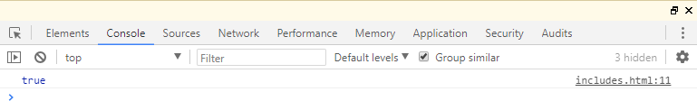
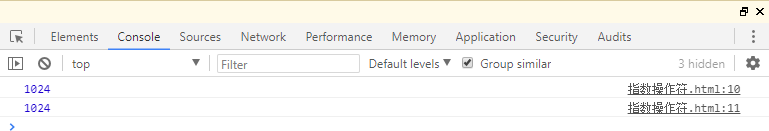

# 四、ES7 新特性
<!-- Markdown 目录语法 -->
[[toc]]
## 0、功能概述

> **1、Array.prototype.includes**
>
> 判断数组中是否包含某元素，语法：arr.includes(元素值)；
>
> **2、指数操作符**
>
> 幂运算的简化写法，例如：2的10次方：2**10；

## 1、Array.prototype.includes

### 概述：

> Includes 方法用来检测数组中是否包含某个元素，返回布尔类型值；
> 判断数组中是否包含某元素，语法：arr.includes(元素值)；

### 代码实现： 
```html
<!DOCTYPE html>
<html>
  <head>
    <meta charset="utf-8" />
    <title>includes</title>
  </head>
  <body>
    <script>
      // includes
      let arr = [1, 2, 3, 4, 5];
      console.log(arr.includes(1));
    </script>
  </body>
</html>
```

> **运行结果：**

### 

> 

## 2、指数操作符
### 概述：

> 在 ES7 中引入指数运算符「**」，用来实现幂运算，功能与 Math.pow
> 结果相同； 幂运算的简化写法，例如：2的10次方：2**10；

### 代码实现： 
```html
<!DOCTYPE html>
<html>
  <head>
    <meta charset="utf-8" />
    <title>指数操作符</title>
  </head>
  <body>
    <script>
      // 指数操作符console.log(Math.pow(2,10)) console.log(2**10);
    </script>
  </body>
</html>
```
### 运行结果：


