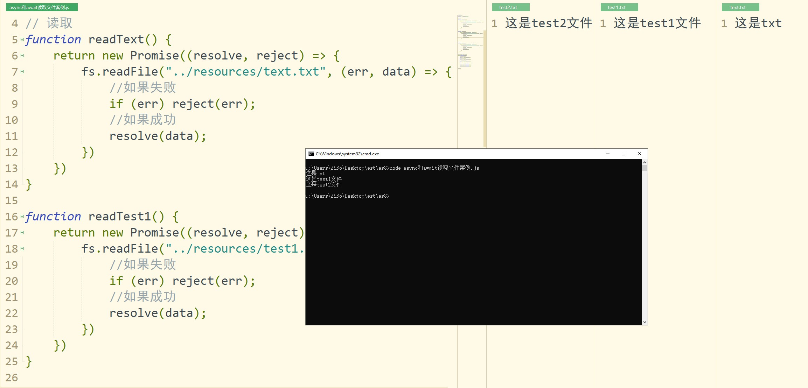
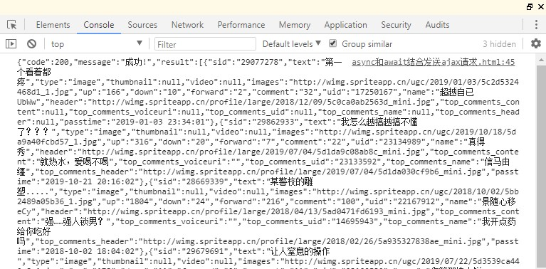
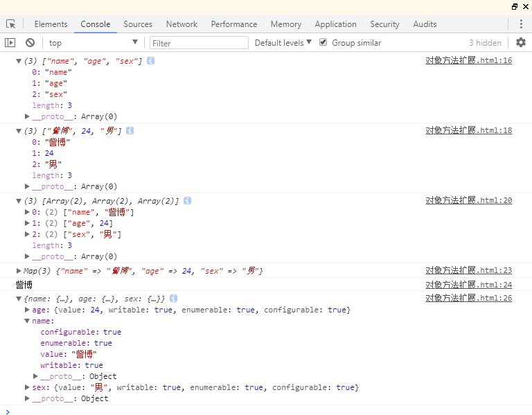

# 五、ES8 新特性
<!-- Markdown 目录语法 -->
[[toc]]
## 0、功能概述

## 1、async 和 await

> 简化异步函数的写法；

## 2、对象方法扩展

> 对象方法扩展；

## 1、async 和 await

### 概述：

> async 和 await 两种语法结合可以让异步代码看起来像同步代码一样；
> 简化异步函数的写法；

### async 函数：

#### 概述：

1.  async 函数的返回值为 promise 对象；
2.  promise 对象的结果由 async 函数执行的返回值决定；

#### 代码实现：
```html
<!DOCTYPE html>
<html>
  <head>
    <meta charset="utf-8" />
    <title>async函数</title>
  </head>
  <body>

    <script>
      // async函数：异步函数async function fn(){
      // return 123; // 返回普通数据
      // 若报错，则返回的Promise对象也是错误的
      // throw new Error("出错啦！");
      // 若返回的是Promise对象，那么返回的结果就是Promise对象的结果

      return new Promise((resolve,reject)=>{
      // resolve("成功啦！");
      reject("失败啦！");
      })
      }

      const result = fn();
      // console.log(result); // 返回的结果是一个Promise对象
      // 调用then方法
      result.then(value => { console.log(value);
      },reason => {
        console.warn(reason);
      });
    </script>
  </body>

</html>
```

### await 表达式：

#### 概述：

1.  await 必须写在 async 函数中；
2.  await 右侧的表达式一般为 promise 对象；
3.  await 返回的是 promise 成功的值；
4.  await 的 promise 失败了, 就会抛出异常, 需要通过 try...catch
    捕获处理；

#### 代码实现：
```html
<!DOCTYPE html>
<html>
  <head>
    <meta charset="utf-8" />
    <title>await表达式</title>
  </head>

  <body>
    <script>
      // async函数 + await表达式：异步函数
      // 创建Prmise对象
      const p = new Promise((resolve, reject) => {
        resolve("成功啦！");
      });

      async function fn() {
        // await 返回的是 promise 成功的值let result = await p; console.log(result); // 成功啦！
      }
      fn();
    </script>
  </body>
</html>
```

### async 和 await 读取文件案例：

#### 代码实现： 

// 导入模块
```js
const fs = require("fs");
// 读取
function readText() {
    return new Promise((resolve, reject) => {
        fs.readFile("../resources/text.txt", (err, data) => {
            //如果失败
            if (err) reject(err);
            //如果成功resolve(data);
        })
    })
}

function readTest1() {
    return new Promise((resolve, reject) => {
        fs.readFile("../resources/test1.txt", (err, data) => {
            //如果失败
            if (err) reject(err);
            //如果成功resolve(data);
        })
    })
}

function readTest2() {
    return new Promise((resolve, reject) => {
        fs.readFile("../resources/test2.txt", (err, data) => {
            //如果失败
            if (err) reject(err);
            //如果成功resolve(data);
        })
    })
}

//声明一个 async 函数

async function main() {
    //获取为学内容
    let t0 = await readText();
    //获取插秧诗内容
    let t1 = await readTest1();
    // 获取观书有感

    let t2 = await readTest2();
    console.log(t0.toString()); console.log(t1.toString()); console.log(t2.toString());

}
main();
```

#### 运行结果：



### async 和 await 结合发送ajax请求：

#### 代码实现：
```html
<!DOCTYPE html>
<html>
  <head>
    <meta charset="utf-8" />
    <title>async 和 await 结合发送ajax请求</title>
  </head>
  <body>
    <script>
      // async 和 await 结合发送ajax请求
      function sendAjax(url){
      return new Promise((resolve,reject)=>{

      // 1、创建对象
      const x = new XMLHttpRequest();
      // 2、初始化x.open("GET",url);
      // 3、发送x.send();
      // 4、事件绑定

      x.onreadystatechange = function(){ if(x.readyState == 4){
      if(x.status>=200 && x.status<=299){
      // 成功
      resolve(x.response);
      }else{
      // 失败
      reject(x.status);
      }
      }
      }
      });
      }

      // 测试
      // const result = sendAjax("https://api.apiopen.top/getJoke");
      // result.then(value=>{
      //    console.log(value);
      // },reason=>{
      //    console.warn(reason);
      // })
      // 使 用 async 和 await async function main(){
      let result = await sendAjax("https://api.apiopen.top/getJoke"); console.log(result);
      }
      main();
    </script>

  </body>

</html>
```

#### 运行结果：



## 2、对象方法扩展

### Object.values、Object.entries和Object.getOwnPropertyDescriptors：

1.  Object.values()方法：返回一个给定对象的所有可枚举属性值的数组；
2.  Object.entries()方法：返回一个给定对象自身可遍历属性 [key,value]
    的数组；
3.  Object.getOwnPropertyDescriptors()该方法：返回指定对象所有自身属性的描述对象；

### 代码实现：
```html
<!DOCTYPE html>
<html>
  <head>
    <meta charset="utf-8" />
    <title>对象方法扩展</title>
  </head>
  <body>
    <script>
      // 对象方法扩展
      let school = { name: "訾博", age: 24, sex: "男" };
      // 获取对象所有的键
      console.log(Object.keys(school));
      // 获取对象所有的值
      console.log(Object.values(school));

      // 获 取 对 象 的 entries console.log(Object.entries(school));

      // 创建map
      const map = new Map(Object.entries(school));
      console.log(map);
      console.log(map.get("name"));
      // 返回指定对象所有自身属性的描述对象
      console.log(Object.getOwnPropertyDescriptors(school));
      // 参考内容：
      const obj = Object.create(null, {
        name: {
          // 设置值
          value: "訾博",
          // 属性特性
          writable: true,
          configuration: true,
          enumerable: true,
        },
      });
    </script>
  </body>
</html>
```
### 运行结果：

