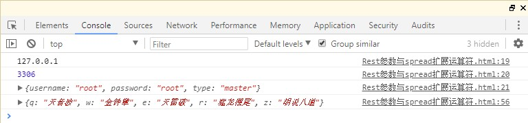
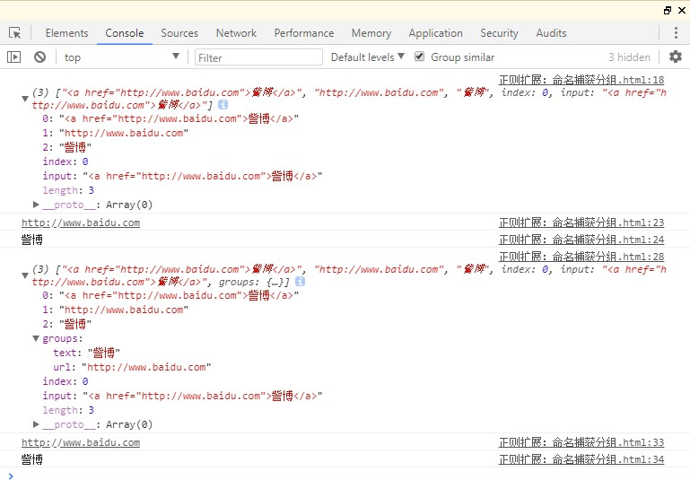
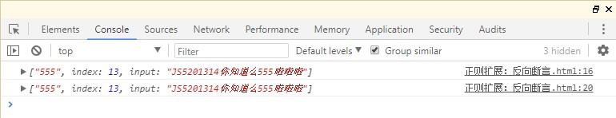
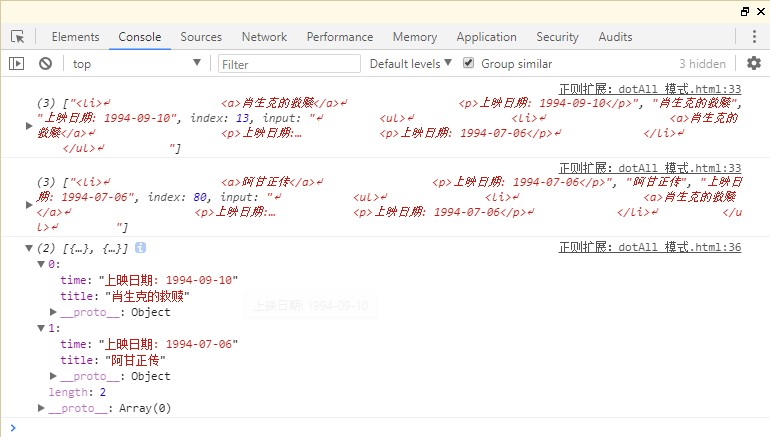

# 六、ES9 新特性
<!-- Markdown 目录语法 -->
[[toc]]
## 0、功能概述

> **1、Rest 参数与 spread 扩展运算符**
> 在对象中使Rest参数与spread扩展运算符；
> **2、正则扩展**
> 简化和增强正则匹配；

## 1、Rest 参数与 spread 扩展运算符
### 概述：
> Rest 参数与 spread 扩展运算符在 ES6 中已经引入，不过 ES6
> 中只针对于数组，在 ES9 中为对象提供了像数组一样的 rest
> 参数和扩展运算符；

### 代码实现：
```html
<!DOCTYPE html>
<html>
  <head>
    <meta charset="utf-8" />
    <title>Rest参数与spread扩展运算符</title>
  </head>
  <body>
    <script>
      // Rest参数与spread扩展运算符
      // Rest 参数与 spread 扩展运算符在 ES6 中已经引入，
      // 不过 ES6 中只针对于数组，在 ES9 中为对象提供了像
      // 数组一样的 rest 参数和扩展运算符；
      //rest 参数
      function connect({ host, port, ...user }) {
        console.log(host);
        console.log(port);
        console.log(user);
      }

      connect({
        host: "127.0.0.1",
        port: 3306,
        username: "root",
        password: "root",
        type: "master",
      });

      //对象合并
      const skillOne = { q: "天音波" };
      const skillTwo = { w: "金钟罩" };
      const skillThree = { e: "天雷破" };
      const skillFour = {
        r: "猛龙摆尾",
        // 自己测试，可用
        z: "胡说八道",
      };

      const mangseng = {
        ...skillOne,
        ...skillTwo,
        ...skillThree,
        ...skillFour,
      };
      console.log(mangseng);
      // ...skillOne    =>  q: '天音波', w: '金钟罩'
    </script>
  </body>

</html>
```

### 运行结果：


## 2、正则扩展：命名捕获分组

### 概述：

> ES9 允许命名捕获组使用符号『?』,这样获取捕获结果可读性更强；

### 代码实现： 
```html
<!DOCTYPE html>

<html>
  <head>
   <meta charset="utf-8" />
    <title>正则扩展：命名捕获分组</title>
  </head>
  <body>
    <script>
      // 正则扩展：命名捕获分组
      // 声明一个字符串
      let str = '<a href="http://www.baidu.com">訾博</a>';
      // 需求：提取url和标签内文本
      // 之前的写法
      const reg = /<a href="(.*)">(.*)</a>/;
      // 执行
      const result = reg.exec(str);
      console.log(result);

      // 结果是一个数组，第一个元素是所匹配的所有字符串
      // 第二个元素是第一个(.*)匹配到的字符串
      // 第三个元素是第二个(.*)匹配到的字符串
      // 我们将此称之为捕获console.log(result[1]); console.log(result[2]);
      // 命名捕获分组

      const reg1 = /<a href="(?<url>.*)">(?<text>.*)</a>/;
      const result1 = reg1.exec(str);
      console.log(result1);

      // 这里的结果多了一个groups
      // groups:
      // text:"訾博"
      // url:"http://www.baidu.com" console.log(result1.groups.url); console.log(result1.groups.text);
    </script>
  </body>
</html>
```

### 运行结果：



## 3、正则扩展：反向断言
### 概述：
> ES9 支持反向断言，通过对匹配结果前面的内容进行判断，对匹配进行筛选；
### 代码实现： 
```html
<!DOCTYPE html>
<html>
  <head>
    <meta charset="utf-8" />
    <title>正则扩展：反向断言</title>
  </head>
  <body>
    <script>
      // 正则扩展：反向断言
      // 字符串
      let str = "JS5201314你知道么555啦啦啦"; // 需求：我们只想匹配到555 // 正向断言
      const reg = /d+(?=啦)/; // 前面是数字后面是啦const result = reg.exec(str); console.log(result); // 反向断言
      const reg1 = /(?<=么)d+/; // 后面是数字前面是么const result1 = reg.exec(str); console.log(result1);
    </script>
  </body>
</html>
```

### 运行结果：


>## 4、正则扩展：dotAll 模式
### 概述：

> 正则表达式中点.匹配除回车外的任何单字符，标记『s』改变这种行为，允许行终止符出现；

### 代码实现：
```html
<!DOCTYPE html>
<html>
  <head>
    <meta charset="utf-8" />
    <title>正则扩展：dotAll 模式</title>
  </head>
  <body>
    <script>
      // 正则扩展：dotAll 模式
      // dot就是. 元字符，表示除换行符之外的任意单个字符
      let str = `
            <ul>
            <li>
            <a>肖生克的救赎</a>
            <p>上映日期: 1994-09-10</p>
            </li>
            <li>
            <a>阿甘正传</a>
            <p>上映日期: 1994-07-06</p>
            </li>
            </ul>
            `;

      // 需求：我们想要将其中的电影名称和对应上映时间提取出来，存到对象
      // 之前的写法
      // const reg = /<li>s+<a>(.*?)</a>s+<p>(.*?)</p>/;
      // dotAll 模式
      const reg = /<li>.*?<a>(.*?)</a>.*?<p>(.*?)</p>/gs;
      // const result = reg.exec(str);
      // console.log(result); let result;
      let data = [];
      while ((result = reg.exec(str))) {
        console.log(result);
        data.push({ title: result[1], time: result[2] });
      }
      console.log(data);
    </script>
  </body>
</html>
```
### 运行结果：

