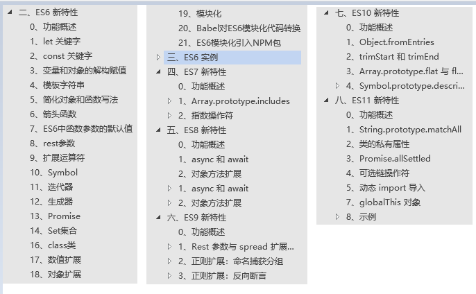

# ES6-ES12学习笔记
<!-- Markdown 目录语法 -->
[[toc]]

文件信息

  **名称**     
------------ ------------
  **整理人**   Longfc
  **所有者**   Longfc
  **状态**     [整理中]
  **版本**     V1.0

## 一、概述

### 1、什么是 ECMA

> ECMA（European Computer Manufacturers
> Association）中文名称为欧洲计算机制造商协会，这个组织的目标是评估、开发和认可电信和计算机标准。1994
> 年后该组织改名为 Ecma 国际；

### 2、什么是 ECMAScript

> ECMAScript 是由 Ecma 国际通过 ECMA-262 标准化的脚本程序设计语言；
>
> 百度百科：<https://baike.baidu.com/history/ECMAScript/1889420/144946978>

### 3、什么是 ECMA-262

> Ecma 国际制定了许多标准，而 ECMA-262
> 只是其中的一个，所有标准列表查看：
>
> [h]{.ul}
> [[ttp://www.ecma-international.org/publications/standards/Standard.htm]{.ul}](http://www.ecma-international.org/publications/standards/Standard.htm)

### 4、ECMA-262 历史

> ECMA-262（ECMAScript）历史版本查看网址：
>
> [h]{.ul}
> [[ttp://www.ecma-international.org/publications/standards/Ecma-262-arch.htm]{.ul}](http://www.ecma-international.org/publications/standards/Ecma-262-arch.htm)

| > **版本** | **时间** | **概述**                                   |
| ---------- | -------- | ------------------------------------------ |
| > 第 1 版  | 1997     | 制定了语言的基本语法                       |
|            |          |                                            |
| > 第 2 版  | 1998     | 较小改动                                   |
|            |          |                                            |
| > 第 3 版  | 1999     | 引入正则、异常处理、格式化输出等。IE       |
|            |          | 开始支持                                   |
| > 第 4 版  | 2007     | 过于激进，未发布                           |
|            |          |                                            |
| > 第 5 版  | 2009     | 引入严格模式、JS                           |
|            |          | ON，扩展对象、数组、原型、字符串、日期方法 |
| > 第 6 版  | 2015     | 模块化、面向对象语法、P                    |
|            |          | romise、箭头函数、let、const、数组解构赋值 |
| > 第 7 版  | 2016     | 幂运算符、数组扩展、Async/await 关键字     |
|            |          |                                            |
| > 第 8 版  | 2017     | Async/await、字符串扩展                    |
|            |          |                                            |
| > 第 9 版  | 2018     | 对象解构赋值、正则扩展                     |
|            |          |                                            |
| > 第 10 版    | 2019     | 扩展对象、数组方法                         |
| >          |          |                                            |
| > 第 11 版   | 2020     | 链式操作、动态导入等                       |
| >          |          |                                            |
| > ES.next  | 2020+    | 动态指向下一个版本                         |

> **注：从 ES6 开始，每年发布一个版本，版本号比年份最后一位大 1；**

### 5、谁在维护 ECMA-262

> TC39（Technical Committee 39）是推进 ECMAScript
> 发展的委员会。其会员都是公司（其中主要是浏览器厂商，有苹果、谷歌、微软、因特尔等）。TC39
> 定期召开会议，会议由会员公司的代表与特邀专家出席；

### 6、为什么要学习 ES6

> ES6 的版本变动内容最多，具有里程碑意义；
>
> ES6 加入许多新的语法特性，编程实现更简单、高效；
>
> ES6 是前端发展趋势，就业必备技能；
>
>### 7、ES6 兼容性

> 查看网址：<http://kangax.github.io/compat-table/es6>

