# Git
## Git 安装
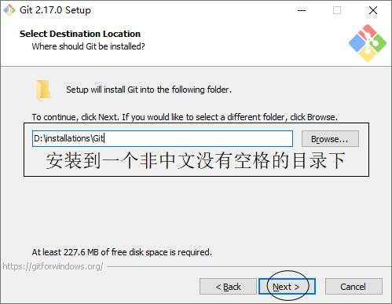

> 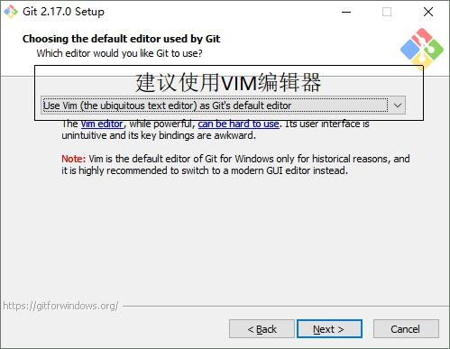

> 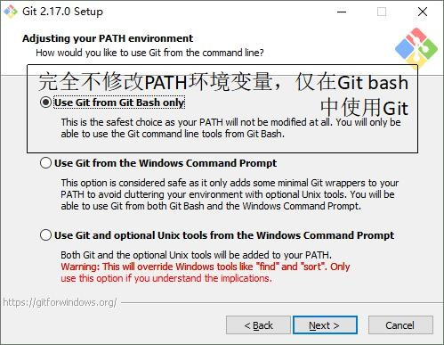

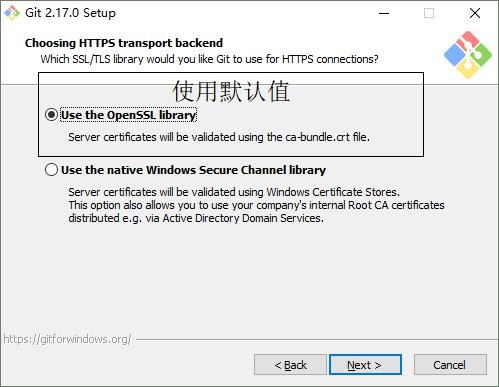

> 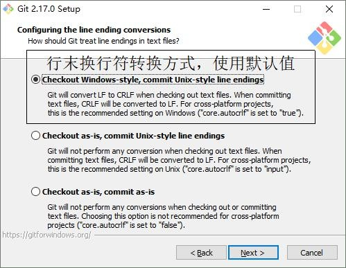

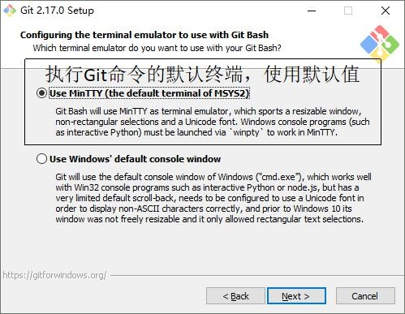

> 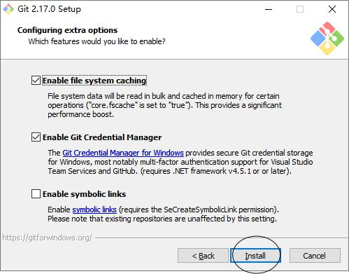

> 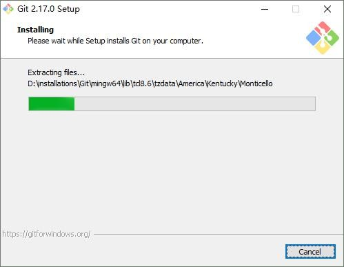

> 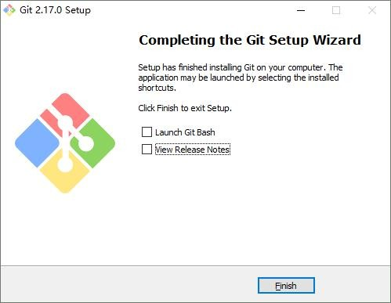

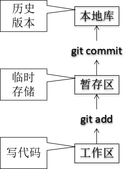

1.  **Git 结构**
2.  **Git 和代码托管中心**
> 代码托管中心的任务：维护远程库

-   局域网环境下
    -   GitLab 服务器
-   外网环境下

    -   GitHub

    -   码云

## 设置签名

-   形式

> 用户名：tom
>
> Email 地址：<goodMorning@atguigu.com>

-   作用：区分不同开发人员的身份

-   辨析：这里设置的签名和登录远程库(代码托管中心)的账号、密码没有任何关
    系。

-   命令

    -   项目级别/仓库级别：仅在当前本地库范围内有效
        -   git **config** user.name tom_pro
        -   git **config** user.email <goodMorning_pro@atguigu.com>
        -   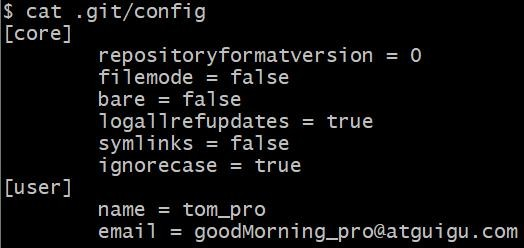信息保存位置：./.git/config
            文件
    -   系统用户级别：登录当前操作系统的用户范围
        -   git config **\--global** user.name tom_glb
        -   git config **\--global** <goodMorning_pro@atguigu.com>
        -   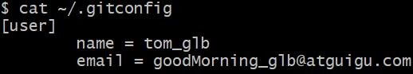信息保存位置：\~/.gitconfig 文件

    -   级别优先级
        -   就近原则：项目级别优先于系统用户级别，二者都有时采用项目级别
            的签名
        -   如果只有系统用户级别的签名，就以系统用户级别的签名为准
        -   二者都没有不允许

## 基本操作

### 状态查看
```js
> git status
>
> 查看工作区、暂存区状态
```

### 添加
```js
> git add \[file name\]
```
> 将工作区的"新建/修改"添加到暂存区

### 提交
```js
> git commit -m \"commit message\" \[file name\]
```
> 将暂存区的内容提交到本地库

### 查看历史记录

> 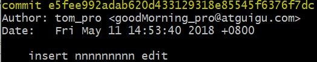git log
>
> 多屏显示控制方式： 空格向下翻页 b 向上翻页
>
> q 退出
>
> 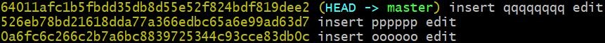git log \--pretty=oneline
>
> 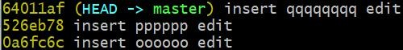git log \--oneline
>
> 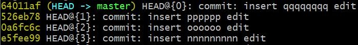}git reflog
>
> HEAD@{移动到当前版本需要多少步}

5.  ### 前进后退

    -   本质

> 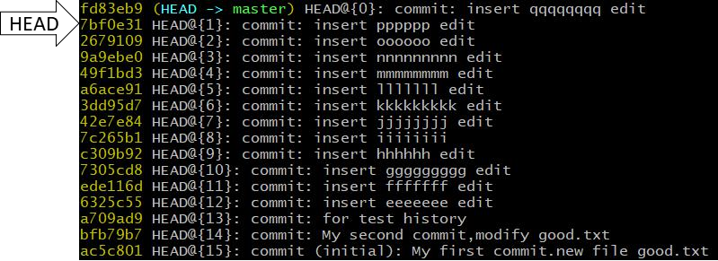

- 基于索引值操作\[推荐\]

  ```js
    -   git reset \--hard \[局部索引值\]
    
  -   git reset \--hard a6ace91
  ```
 ```

-   使用\^符号：只能后退

    -   git reset \--hard HEAD\^

    -   注：一个\^表示后退一步，n 个表示后退 n 步

-   使用\~符号：只能后退

    -   git reset \--hard HEAD\~n

    -   注：表示后退 n 步

1.  ### reset 命令的三个参数对比

    -   \--soft 参数

        -   仅仅在本地库移动 HEAD 指针

    -   \--mixed 参数

        -   在本地库移动 HEAD 指针

        -   重置暂存区

    -   \--hard 参数

        -   在本地库移动 HEAD 指针

        -   重置暂存区

        -   重置工作区

2.  ### 删除文件并找回

    -   前提：删除前，文件存在时的状态提交到了本地库。

    -   操作：git reset \--hard \[指针位置\]

        -   删除操作已经提交到本地库：指针位置指向历史记录

        -   删除操作尚未提交到本地库：指针位置使用 HEAD

3.  ### 比较文件差异

    -   git diff \[文件名\]

        -   将工作区中的文件和暂存区进行比较

    -   git diff \[本地库中历史版本\] \[文件名\]

        -   将工作区中的文件和本地库历史记录比较

    -   不带文件名比较多个文件

## 分支管理

### 什么是分支？

> 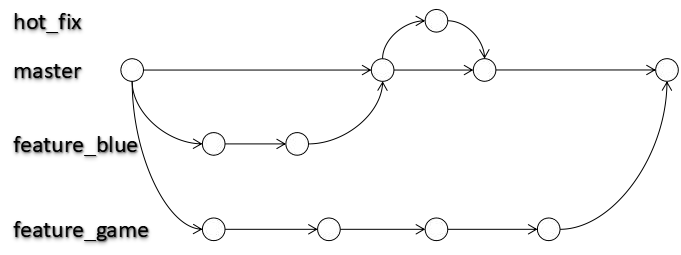在版本控制过程中，使用多条线同时推进多个任务。

2.  ### 分支的好处？

    -   同时并行推进多个功能开发，提高开发效率
    -   各个分支在开发过程中，如果某一个分支开发失败，不会对其他分支有任
        何影响。失败的分支删除重新开始即可。

3.  ### 分支操作

    -   创建分支
​```js
> git branch \[分支名\]
 ```

-   查看分支
```js
> git branch -v
```

-   切换分支
```js
> git checkout \[分支名\]
```

-   合并分支

    -   第一步：切换到接受修改的分支（被合并，增加新内容）上

> git checkout \[被合并分支名\]

-   第二步：执行 merge 命令

> git merge \[有新内容分支名\]

-   解决冲突

    -   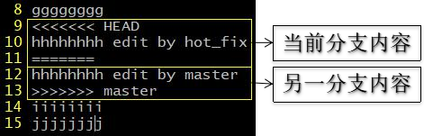冲突的表现

    -   冲突的解决

        -   第一步：编辑文件，删除特殊符号
        -   第二步：把文件修改到满意的程度，保存退出
        -   第三步：git add \[文件名\]
        -   第四步：git commit -m \"日志信息\"
        -   注意：此时 commit 一定不能带具体文件名
