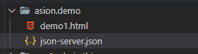

# JSON-Server

## 安装JSON-Server(Install JSON Server)
```js
npm install -g json-server
```

## 创建JSON数据源(Create a JSON file)



先创建一个db-server.json文件

## 启动JOSN服务器(Start JSON Server)
```js
json-server \--watch db-server.json
```
