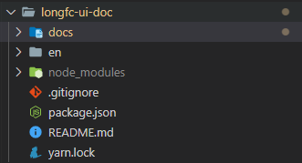
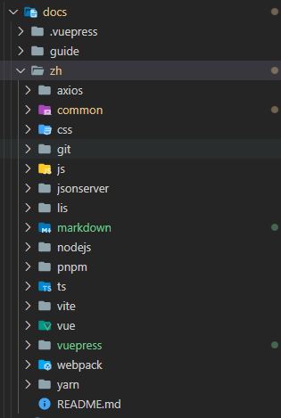
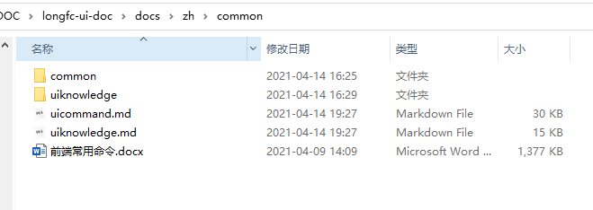
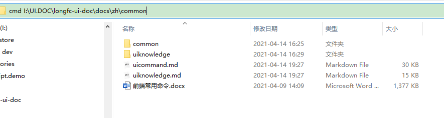
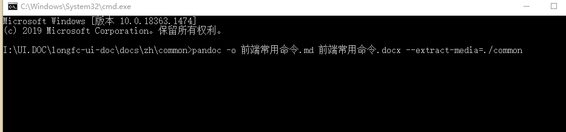
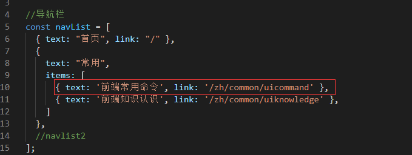
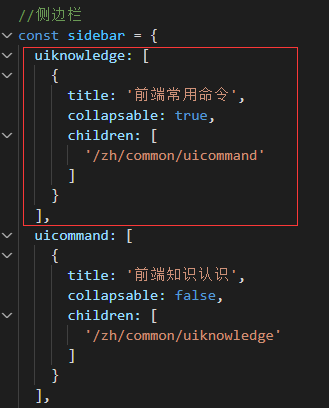
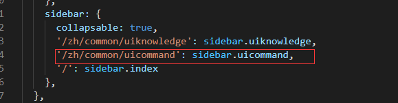
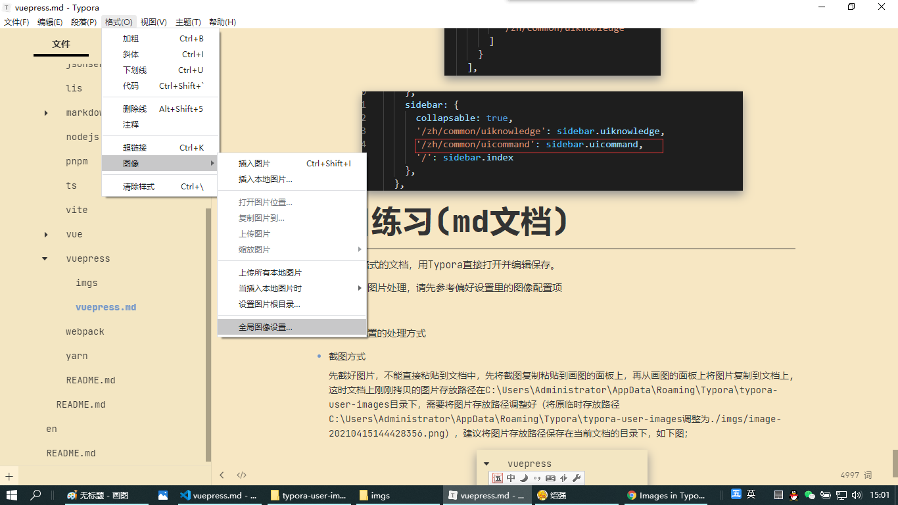
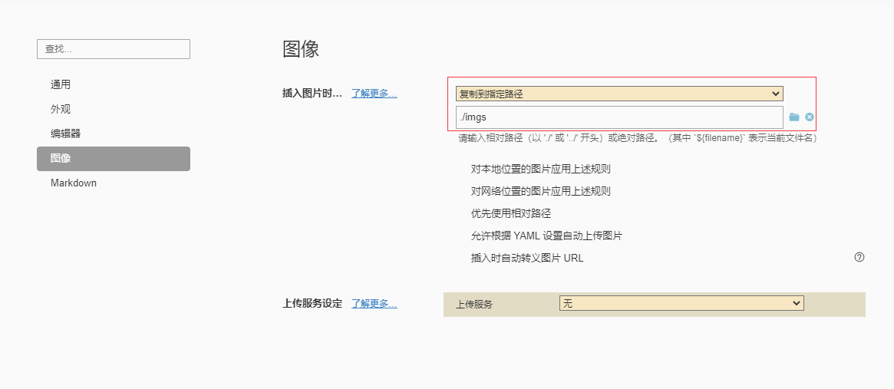

# 项目练习（word转换）
<!-- Markdown 目录语法 -->
[[toc]]
## 转换word文档

先搭建好基础项目框架，如下图



展开docs文件夹，如下图



将需要转换word文档拷贝到相应的文件夹目录下，如在\docs\zh\common下转换<<前端常用命令.docx>>，



准备好转换生成md文档格式的pandoc命令，如

```sh
pandoc -o 前端常用命令.md 前端常用命令.docx --extract-media=./common
```

在当前目录下打开cmd命令窗口，如下图



将执行命令“pandoc -o 前端常用命令.md 前端常用命令.docx --extract-media=./common”拷贝到命令窗口里执行，如下图



执行完成后，会在当前目录下生成一份“前端常用命令.md”文件，可以修改文件名称为uicommand.md后打开，可以使用Typora或VS Code打开，转换生成的md文件，如果有图片，需要手工替换图片后面的宽高代码信息。

## 访问入口配置

打开.vuepress文件夹下的config.js文件，将刚刚生成的uicommand.md添加到导航栏或侧边栏里，完成打开访问的入口配置

### 导航栏配置



### 侧边栏配置





# 项目练习(md文档)

新建一个md格式的文档，用Typora直接打开并编辑保存。

注意：文档的图片处理，请先参考偏好设置里的图像配置项





以下是未作配置的处理方式

- 截图方式

  先截好图片，不能直接粘贴到文档中，先将截图复制粘贴到画图的面板上，再从画图的面板上将图片复制到文档上,这时文档上刚刚拷贝的图片存放路径在C:\Users\Administrator\AppData\Roaming\Typora\typora-user-images目录下，需要将图片存放路径调整好（将原临时存放路径C:\Users\Administrator\AppData\Roaming\Typora\typora-user-images调整为./imgs/image-20210415144428356.png），建议将图片存放路径保存在当前文档的目录下，如下图；

- 插入图像方式